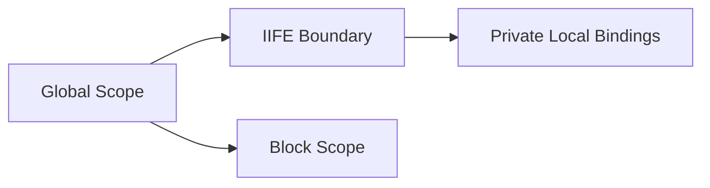

# CH-02: Scope Boundaries (Script Isolation)

> **"Teknik isolasi sementara untuk menahan kebocoran energi di dunia script klasik."**

**Source Hub**:
- [ECMA-262: Scripts](https://tc39.es/ecma262/#sec-scripts)
- [ECMA-262: Function Definitions](https://tc39.es/ecma262/#sec-function-definitions)

---

## 1. Mental Model: "The Temporary Seal"

Sebelum module menjadi default, teknisi mengandalkan batas buatan:
- **IIFE** untuk membungkus state,
- **block scope** untuk membatasi binding `let` dan `const`,
- konvensi namespace manual untuk menurunkan risiko tabrakan.

---

## 2. Visualisasi Sistem: Local Seal Pattern

---

## 3. Mekanisme & Hubungan

1. IIFE membuat execution context tersendiri sehingga binding internal tidak bocor ke global.
2. `let` dan `const` membatasi jangkauan binding pada block, meskipun file-nya tetap script.
3. Batas-batas ini membantu, tetapi tidak menggantikan isolation contract yang diberikan modules.

---

## 4. Lab Praktis

Buka file `examples/01_scope_boundaries_lab.js` untuk membandingkan isolasi IIFE dengan block scope pada mode script.

---

## 5. Arsitek Mindset: Disiplin Batas

- Gunakan IIFE hanya sebagai teknik transisi pada codebase legacy.
- Jangan jadikan namespace global sebagai sistem dependency permanen.
- Anggap batas buatan ini sebagai mitigation, bukan solusi final.

---
*Status: [x] Complete | [status.md](../../../docs/status.md)*
