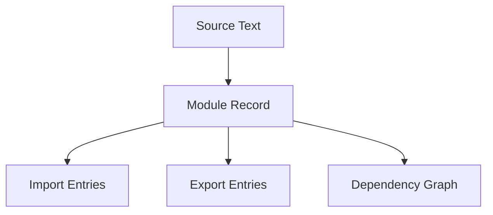

# CH-01: Module Records (The Structural Blueprints)

> **"Blueprint statis yang memungkinkan jaringan modul dibaca sebelum energinya dijalankan."**

**Source Hub**:
- [ECMA-262: Modules](https://tc39.es/ecma262/#sec-modules)
- [ECMA-262: Source Text Module Records](https://tc39.es/ecma262/#sec-source-text-module-records)

---

## 1. Mental Model: "The Network Map"

Module tidak langsung dijalankan saat ditemukan. Engine terlebih dahulu membangun representasi struktural:
- daftar impor,
- daftar ekspor,
- hubungan dependensi,
- identitas modul di dalam graph.

---

## 2. Visualisasi Sistem: Module Record Graph

---

## 3. Mekanisme & Hubungan

1. Module record memungkinkan engine melakukan analisis statis sebelum evaluation.
2. Graph dependensi dibentuk lebih awal sehingga error linkage bisa terdeteksi sebelum top-level code berjalan.
3. Sifat singleton pada module muncul karena satu record yang sama dipakai ulang dalam graph yang sama.

---

## 4. Lab Praktis

Buka file `examples/01_module_records_lab.mjs` untuk melihat impor yang membaca konfigurasi dari satu sumber dan tetap bekerja sebagai satu graph yang sama.

---

## 5. Arsitek Mindset: Keuntungan Statis

- Module record adalah alasan mengapa ESM kuat untuk tooling dan optimasi.
- Struktur statis memberi fondasi untuk tree shaking dan dependency validation.
- Pahami graph-nya, bukan hanya sintaks `import`/`export`-nya.

---
*Status: [x] Complete | [status.md](../../../docs/status.md)*
