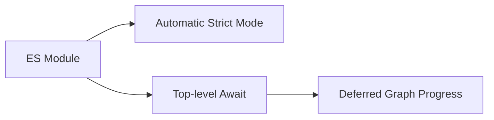

# CH-02: Reinforced Cables (Modern ESM Features)

> **"Fitur modern ESM yang memperkuat isolasi, strictness, dan sinkronisasi jaringan."**

**Source Hub**:
- [ECMA-262: Modules](https://tc39.es/ecma262/#sec-modules)
- [ECMA-262: Import Calls](https://tc39.es/ecma262/#sec-import-calls)

---

## 1. Mental Model: "The Reinforced Channel"

Modul modern tidak hanya terisolasi, tetapi juga punya protokol yang lebih keras:
- strict mode otomatis,
- top-level await,
- eksekusi yang selaras dengan graph dependensi.

---

## 2. Visualisasi Sistem: Reinforced ESM Channel

---

## 3. Mekanisme & Hubungan

1. Module goal secara otomatis mengaktifkan strict semantics.
2. Top-level await dapat menahan progres evaluation untuk graph dependensi yang relevan.
3. Penguatan ini membuat module lebih aman, tetapi juga membuat bottleneck lebih mudah muncul bila desain graph buruk.

---

## 4. Lab Praktis

Buka file `examples/01_reinforced_cables_lab.mjs` untuk melihat modul yang memakai `await` di level teratas sebelum mengumumkan dirinya siap.

---

## 5. Arsitek Mindset: Sinkronisasi Jaringan

- Gunakan top-level await hanya pada inisialisasi yang benar-benar layak menahan graph.
- Jangan campur kebutuhan sinkronisasi global dengan efek samping yang seharusnya dipicu belakangan.
- Ingat bahwa kekuatan modern ESM datang bersama biaya koordinasi graph.

---
*Status: [x] Complete | [status.md](../../../docs/status.md)*
