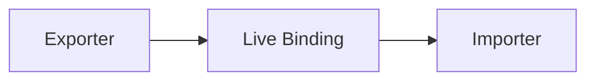

# CH-01: Static Routing (Permanent Bindings)

> **"Jalur distribusi permanen yang dikunci sejak parsing dan linkage."**

**Source Hub**:
- [ECMA-262: Modules](https://tc39.es/ecma262/#sec-modules)
- [ECMA-262: Imports](https://tc39.es/ecma262/#sec-imports)
- [ECMA-262: Exports](https://tc39.es/ecma262/#sec-exports)

---

## 1. Mental Model: "The Fixed Cable"

Static imports dan exports membentuk kabel tetap di graph:
- bindings ditentukan sebelum evaluation,
- import tidak mengambil salinan, melainkan live binding,
- struktur jalur diketahui lebih awal oleh engine dan tooling.

---

## 2. Visualisasi Sistem: Static Binding Route

---

## 3. Mekanisme & Hubungan

1. Static routing hanya menerima specifier yang bisa dianalisis secara statis.
2. Live binding membuat pengimpor melihat perubahan nilai di modul asal.
3. Default dan named exports memberi dua bentuk kontrak distribusi yang berbeda.

---

## 4. Lab Praktis

Buka file `examples/01_static_routing_lab.mjs` untuk melihat named export dan pembacaan nilai dari jalur statis yang sama.

---

## 5. Arsitek Mindset: Kejelasan Aliran

- Named exports biasanya memberi traceability yang lebih baik.
- Static routing adalah fondasi optimasi bundler dan validasi graph.
- Jangan perlakukan import statis seperti assignment biasa; semantiknya lebih ketat.

---
*Status: [x] Complete | [status.md](../../../docs/status.md)*
