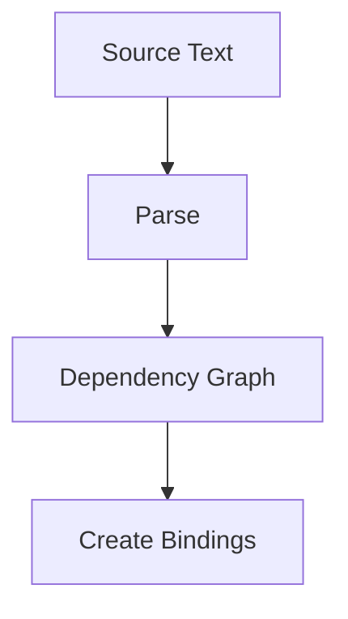

# CH-01: Parsing Phase

> **"Fase pembacaan dan persiapan binding sebelum satu baris energi dievaluasi."**

**Source Hub**:
- [ECMA-262: ParseModule](https://tc39.es/ecma262/#sec-parsemodule)
- [ECMA-262: ModuleDeclarationInstantiation](https://tc39.es/ecma262/#sec-moduledeclarationinstantiation)

---

## 1. Mental Model: "Setting Up the Rails"

Sebelum evaluation, engine harus:
- membaca source text,
- memastikan sintaks valid,
- membentuk dependency graph,
- menyiapkan binding ekspor dan impor.

---

## 2. Visualisasi Sistem: Parse and Instantiate Pipeline

---

## 3. Mekanisme & Hubungan

1. Parsing memastikan module goal dan struktur sintaksnya valid.
2. Instantiation membangun binding lebih dulu sebelum nilai dihitung.
3. Fase ini menjelaskan mengapa cyclic dependency dan uninitialized access bisa muncul bahkan sebelum evaluation selesai.

---

## 4. Lab Praktis

Buka file `examples/01_parsing_phase_lab.mjs` untuk melihat modul yang hanya mengekspor binding sederhana tetapi tetap melewati jalur parse dan instantiation.

---

## 5. Arsitek Mindset: Keamanan Jalur

- Error pada fase awal bisa membatalkan seluruh graph.
- Validasi specifier dan struktur ekspor sejak awal sangat penting.
- Jangan anggap instantiation sebagai formalitas; ia adalah bagian inti dari kontrak ESM.

---
*Status: [x] Complete | [status.md](../../../docs/status.md)*
