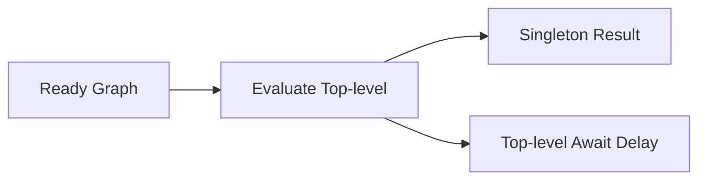

# CH-02: Evaluation Phase

> **"Fase ketika graph yang sudah siap akhirnya dialiri energi top-level."**

**Source Hub**:
- [ECMA-262: ModuleEvaluation](https://tc39.es/ecma262/#sec-moduleevaluation)

---

## 1. Mental Model: "The Energy Burst"

Setelah parsing dan instantiation selesai, evaluation:
- mengeksekusi top-level code,
- menghitung nilai aktual,
- menjaga sifat singleton modul,
- dapat tertunda oleh top-level await.

---

## 2. Visualisasi Sistem: Module Evaluation Burst

---

## 3. Mekanisme & Hubungan

1. Evaluation menjalankan top-level code berdasarkan urutan graph yang valid.
2. Modul yang sudah selesai tidak dievaluasi ulang sembarangan dalam graph yang sama.
3. Top-level await dapat menahan modul-modul yang bergantung padanya.

---

## 4. Lab Praktis

Buka file `examples/01_evaluation_phase_lab.mjs` untuk melihat top-level evaluation dan hasil namespace yang dipakai ulang.

---

## 5. Arsitek Mindset: Efek Samping Eksekusi

- Minimalkan side effect berat di top-level module.
- Pahami kapan initialization memang layak dilakukan di evaluation.
- Gunakan graph secara sadar agar keterlambatan async tidak menyebar tanpa kontrol.

---
*Status: [x] Complete | [status.md](../../../docs/status.md)*
