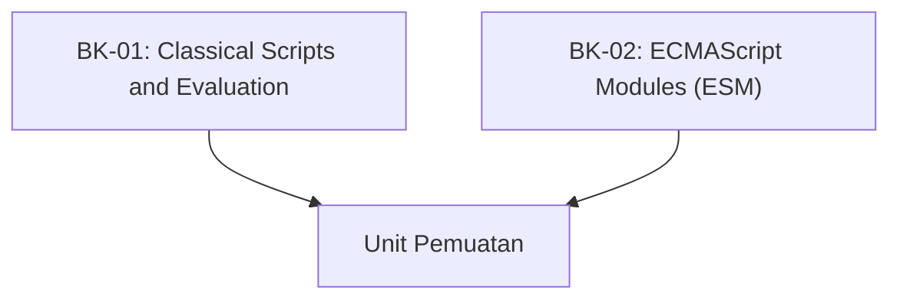

# SR-10: Scripts and Modules (The Unit of Loading)

> **"Wadah Penampung Energi Massal. SR-10 membedah 'Skrip dan Modul' (The Unit of Loading)—bagaimana unit-unit kode dimuat, dihubungkan, dan dieksekusi."**

**Source Hub**: 
- [ECMA-262: Scripts and Modules](https://tc39.es/ecma262/#sec-ecmascript-language-scripts-and-modules)

---

## 🏗️ The 2 Pillars of Loading Architecture

---

## Koleksi Buku:
1.  **[BK-01: Classical Scripts and Evaluation](./BK-01_Scripts/)**: Evaluasi kode tradisional, Global Environment, dan mode non-strict.
2.  **[BK-02: ECMAScript Modules (ESM)](./BK-02_Modules/)**: Struktur modular modern, mekanisme ekspor/impor, dan evaluasi asinkron.

---
*Status: [status.md](../../status.md) | Back to [RAK-04](../README.md)*
