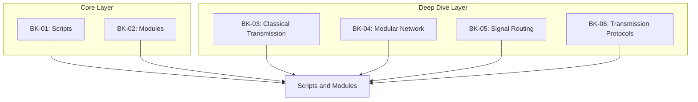

# SR-10: Scripts and Modules (The Unit of Loading)

> **"Bagaimana unit kode dimuat, dipetakan, dan dievaluasi di dalam Grid."**

**Source Hub**:
- [ECMA-262: Scripts and Modules](https://tc39.es/ecma262/#sec-ecmascript-language-scripts-and-modules)

---

## The 6-Book Loading Architecture

---

## Koleksi Buku
1. **[BK-01: Classical Scripts and Evaluation](./BK-01_Scripts/)**: evaluasi script tradisional, global host, dan perilaku non-module.
2. **[BK-02: ECMAScript Modules (ESM)](./BK-02_Modules/)**: module records, linkage, live bindings, dan evaluation modern.
3. **[BK-03: Classical Transmission](./BK-03_ClassicalTransmission/)**: pendalaman script terbuka, global execution, dan batas-batas isolasi di mode klasik.
4. **[BK-04: Modular Network](./BK-04_ModularNetwork/)**: pendalaman module records, strictness otomatis, dan fitur modern seperti top-level await.
5. **[BK-05: Signal Routing](./BK-05_SignalRouting/)**: pemisahan jalur distribusi statis dan dinamis antar modul.
6. **[BK-06: Transmission Protocols](./BK-06_TransmissionProtocols/)**: fase parsing, instantiation, dan evaluation pada pipeline pemuatan modul.

---

## Catatan Audit Struktur

`SR-10` kini diperlakukan sebagai sub-rak 6 buku:
- `BK-01` sampai `BK-02` adalah jalur inti untuk script dan module.
- `BK-03` sampai `BK-06` adalah jalur pendalaman yang sebelumnya hidup sebagai struktur paralel dan kini dinormalisasi sebagai buku eksplisit.

---
*Status: [/] Partial | [status.md](../../status.md) | Back to [RAK-04](../README.md)*
