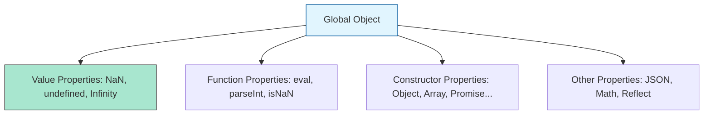

# CH-01: The Global Object and Properties

> **"Akar dari seluruh infrastruktur. `The Global Object and Properties` adalah titik awal di mana semua energi dan referensi di Hub bermuara."**

**Source Hub**: 
- [ECMA-262: The Global Object](https://tc39.es/ecma262/#sec-global-object)

---

## 1. Konsep & Esensi

**Definisi Arsitek**:
**Global Object** adalah objek unik yang diciptakan sebelum eksekusi dimulai. Ia tidak memiliki `[[Construct]]` atau `[[Call]]` dan bertindak sebagai penampung permanen untuk nilai bawaan dan fungsi utilitas global. Di lingkungan modern, ia dapat diakses melalui referensi `globalThis`.

**Model Mental**:
Bayangkan Hub sebagai sebuah gedung. **Global Object** adalah fondasi dan infrastruktur dasarnya (listrik, air, udara) yang sudah tersedia di setiap ruangan (scope) tanpa perlu Anda instal secara manual.

---

## 2. Visualisasi Sistem: Global Property Categories

---

## 3. Mekanisme & Hubungan

### Properti Utama (Clause 19.1 - 19.3)
1. **Value Properties**: Nilai-nilai absolut yang tidak bisa diubah (Writable: false).
2. **Function Properties**: Fungsi "Sakti" seperti `eval` (yang mengevaluasi teks sebagai kode) dan `parseInt` (pemroses leksikal angka). Hati-hati: `eval` bisa membuka celah keamanan di arsitektur Hub Anda.
3. **globalThis (Clause 19.1.1)**: Standar universal untuk mengakses objek global tanpa peduli apakah Anda berada di Browser (`window`) atau Node.js (`global`).

### Arsitek Mindset: Global Decoupling
- Jangan pernah mengandalkan Global Object untuk menyimpan status aplikasi Anda (Global Variables). Ini adalah praktik arsitektur yang buruk karena menciptakan ketergantungan tersembunyi antar sirkuit. Gunakan Modul untuk berbagi data secara eksplisit.

---

## 4. Lab Praktis
Buka file `examples/global_object_audit.js` untuk melihat daftar lengkap properti yang tersedia di objek global Hub Anda saat ini menggunakan `Object.getOwnPropertyNames(globalThis)`.

---
*Status: [status.md](../../../../../status.md)*
