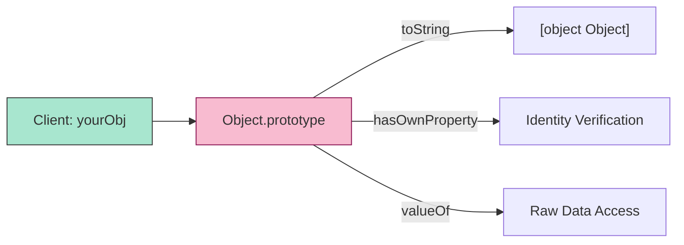

# CH-02: Fundamental Foundations

> **"Material pembentuk struktur. `Fundamental Foundations` adalah kumpulan objek inti yang mendefinisikan sifat dasar data dan sistem error di Hub."**

**Source Hub**: 
- [ECMA-262: Fundamental Objects](https://tc39.es/ecma262/#sec-fundamental-objects)

---

## 1. Konsep & Esensi

**Definisi Arsitek**:
Objek Fundamental mencakup **Object** (induk semua struktur), **Function** (dasar eksekusi), **Boolean** (logika), **Symbol** (identitas unik), dan **Error** (protokol kegagalan). Mereka menyediakan metode statis dan prototipe yang diwarisi oleh hampir semua unit data di Hub.

**Model Mental**:
Bayangkan Hub sebagai produsen massal. Objek Fundamental adalah "Cetakan Induk". Setiap laci yang Anda buat (Object) atau mesin yang Anda pasang (Function) dibuat menggunakan standar dari cetakan induk ini.

---

## 2. Visualisasi Sistem: Object Instance Contract

---

## 3. Mekanisme & Hubungan

### Pilar-Pilar Inti
1. **Object (Clause 20.1)**: Menyediakan metode statis untuk audit sirkuit seperti `Object.keys()`, `Object.freeze()`, dan `Object.create()`.
2. **Symbol (Clause 20.4)**: Digunakan untuk mendefinisikan "Well-Known Symbols" (seperti `@@iterator`) yang memungkinkan teknisi mengkustomisasi perilaku internal Hub pada objek mereka sendiri.
3. **Error (Clause 20.5)**: Menyediakan struktur standar untuk pelaporan kegagalan, termasuk `SyntaxError`, `TypeError`, dan `ReferenceError`.

### Arsitek Mindset: Immutability
- Manfaatkan `Object.freeze()` atau `Object.seal()` untuk mengunci arsitektur konfigurasi Anda. Dengan membekukan objek, Anda menjamin bahwa tidak ada sirkuit pihak ketiga yang bisa secara sembunyi-sembunyi mengubah parameter sistem Anda di tengah jalan.

---

## 4. Lab Praktis
Buka file `examples/fundamental_intrinsics_lab.js` untuk melihat bagaimana penggunaan `Symbol` dapat menyembunyikan properti sensitif dari iterasi standar `for...in`.

---
*Status: [status.md](../../../../../status.md)*
