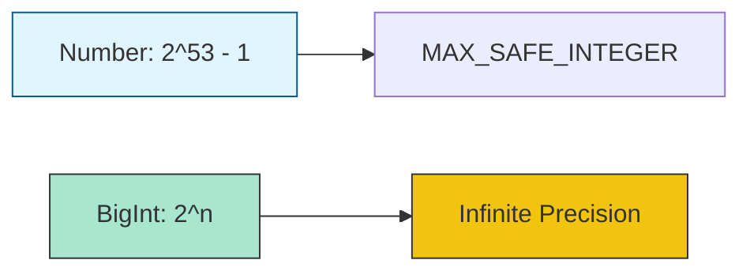

# CH-01: Numbers and BigInt Precision

> **"Akurasi energi numerik. `Numbers and BigInt Precision` mendefinisikan batas-batas perhitungan di dalam sirkuit Hub."**

**Source Hub**: 
- [ECMA-262: Numbers](https://tc39.es/ecma262/#sec-numbers)
- [ECMA-262: BigInt](https://tc39.es/ecma262/#sec-bigint-objects)

---

## 1. Konsep & Esensi

**Definisi Arsitek**:
**Number** adalah tipe 64-bit binary format IEEE 754 yang sangat cepat tapi memiliki limitasi presisi pada angka desimal sangat kecil atau angka sangat besar. **BigInt** diperkenalkan untuk menangani angka bulat dengan presisi arbitrer (tak terbatas oleh 64-bit), memungkinkan Hub memproses data finansial atau identitas besar dengan akurasi 100%.

**Model Mental**:
- **Number**: Kalkulator saku standar. Cepat, tapi terkadang membulatkan angka di belakang koma.
- **BigInt**: Kalkulator akuntansi raksasa. Lambat sedikit, tapi tidak pernah salah hitung satu perak pun.

---

## 2. Visualisasi Sistem: Numeric Range Comparison

---

## 3. Mekanisme & Hubungan

### Karakteristik Numerik
1. **IEEE 754 (Double Precision)**: Hub menyimpan angka dalam format bit yang bisa menyebabkan kesalahan pembulatan pada angka pecahan biner. Selalu gunakan `Number.EPSILON` untuk membandingkan sirkuit numerik yang presisi.
2. **Special Values**: `NaN` (bukan angka), `Infinity`, dan `-Infinity`. Mereka adalah status energi numerik yang valid tapi seringkali menunjukkan kegagalan logika.
3. **BigInt Rules**: Anda tidak bisa mencampur `Number` dan `BigInt` dalam satu operasi aritmatika tanpa konversi eksplisit. Ini adalah pengaman untuk mencegah kehilangan presisi secara tidak sengaja.

### Arsitek Mindset: Precision Safety
- Gunakan `Number` untuk koordinat, grafik, dan perhitungan umum. Selalu beralih ke `BigInt` (misal: `100n`) saat Anda menangani ID yang sangat panjang atau nilai mata uang yang membutuhkan integritas absolut.

---

## 4. Lab Praktis
Buka file `examples/01_numeric_precision_lab.js` untuk membuktikan fenomena `0.1 + 0.2` dan melihat bagaimana `BigInt` menangani angka faktorial besar dengan mudah.

---
*Status: [x] Complete | [status.md](../../../../../status.md)*
