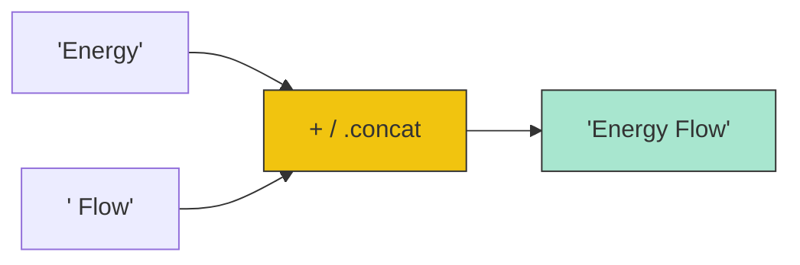

# CH-01: Text Processing and Strings

> **"Energi narasi dalam sirkuit. `Text Processing and Strings` mendefinisikan bagaimana Hub menyimpan dan memanipulasi rentetan karakter Unicode."**

**Source Hub**: 
- [ECMA-262: String Objects](https://tc39.es/ecma262/#sec-string-objects)

---

## 1. Konsep & Esensi

**Definisi Arsitek**:
**String** adalah tipe data primitif yang merepresentasikan teks, namun untuk keperluan manipulasi, Hub secara otomatis membungkusnya dalam **String Object**. Hub menggunakan pengkodean 16-bit code units (UTF-16) di mana karakter tertentu (Emoticon atau simbol langka) mungkin diproses sebagai sepasang *surrogates*.

**Model Mental**:
Bayangkan Hub sebagai seorang juru tulis. **String** adalah gulungan kertas yang berisi laporan. Anda tidak bisa mengubah teks di gulungan yang sudah ada (Immutability), tapi Anda bisa menyalinnya dan membuat laporan baru dengan tambahan kata-kata (Manipulation).

---

## 2. Visualisasi Sistem: String Concatenation Pattern

---

## 3. Mekanisme & Hubungan

### Utilitas Teks (Clause 22.1.3)
1. **Search & Inspection**: `includes()`, `startsWith()`, `endsWith()`. Menggunakan algoritma pemindaian linear untuk menemukan keberadaan substring di dalam sirkuit teks.
2. **Slicing & Extraction**: `slice()`, `substring()`, `split()`. Menciptakan unit data teks baru dari bagian tertentu sirkuit asli.
3. **Normalization**: `normalize()`. Memastikan karakter Unicode yang ditulis berbeda (seperti aksen) memiliki representasi biner yang sama di Hub.

### Arsitek Mindset: Memory Efficiency
- Setiap manipulasi string menciptakan objek baru di memori Warehouse. Jika Anda melakukan penggabungan jutaan string kecil di dalam loop, Hub akan bekerja sangat keras melakukan alokasi dan pembersihan (GC). Untuk sirkuit data besar, kumpulkan bagian-bagian kecil dalam sebuah Array dan gunakan `.join('')` di akhir untuk efisiensi maksimal.

---

## 4. Lab Praktis
Buka file `examples/string_surrogate_lab.js` untuk melihat bagaimana Hub menangani karakter Emoji yang sebenarnya terdiri dari dua unit kode 16-bit.

---
*Status: [status.md](../../../../../status.md)*
