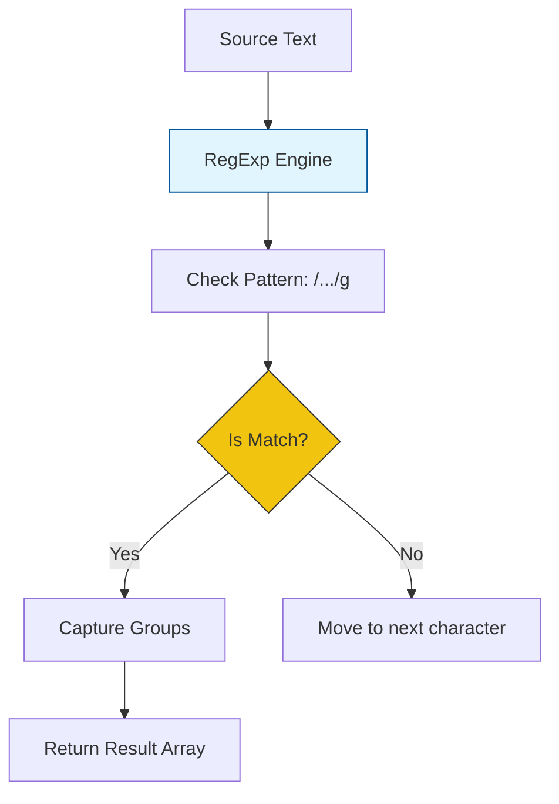

# CH-02: Regular Expression Matching

> **"Mesin pencari pola otomatis. `Regular Expression Matching` adalah sirkuit canggih untuk memvalidasi dan mengekstrak informasi dari teks secara presisi."**

**Source Hub**: 
- [ECMA-262: RegExp Objects](https://tc39.es/ecma262/#sec-regexp-objects)

---

## 1. Konsep & Esensi

**Definisi Arsitek**:
**RegExp** adalah objek eksotis yang mendefinisikan pola pencarian karakter. Di balik layar, Hub menjalankan mesin *Nondeterministic Finite Automaton* (NFA) yang melakukan pencocokan dengan teknik *backtracking*. **Flags** (g, i, m, u, y, s, v) mengubah perilaku mesin pencari ini secara arsitektural.

**Model Mental**:
Bayangkan sebuah saringan pasir canggih di Hub. Anda memasukkan sekeranjang teks, dan saringan ini (RegExp) hanya akan melewatkan butir-butir yang bentuknya sesuai dengan instruksi pola Anda.

---

## 2. Visualisasi Sistem: RegExp Execution Pipeline

---

## 3. Mekanisme & Hubungan

### Karakteristik Pencarian (Clause 22.2)
1. **The 'u' and 'v' Flags**: Sangat krusial untuk teks internasional. Flag `u` (Unicode) menangani pasangan surrogate dengan benar, sementara `v` (Set Notation) memungkinkan operasi set tingkat tinggi pada kelas karakter.
2. **Greedy vs Lazy**: Secara default, RegExp akan mencoba mengambil data sebanyak mungkin. Gunakan `?` untuk mode "Lazy" agar Hub berhenti segera setelah menemukan kecocokan pertama.
3. **Internal Slot `[[RegExpMatcher]]`**: Menyimpan algoritma pencocokan yang sudah dikompilasi dari string pola asli.

### Arsitek Mindset: ReDoS Attacks
- Hati-hati dengan pola yang terlalu kompleks (seperti nested quantifiers). Mesin backtracking Hub bisa terjebak dalam pencarian yang tak berujung, membuang seluruh energi CPU Anda. Selalu uji performa pola RegExp Anda pada data masukan yang besar atau tidak normal.

---

## 4. Lab Praktis
Buka file `examples/regex_performance_audit.js` untuk membandingkan kecepatan antara pola "Greedy" vs "Lazy" pada selembar teks panjang.

---
*Status: [status.md](../../../../../status.md)*
