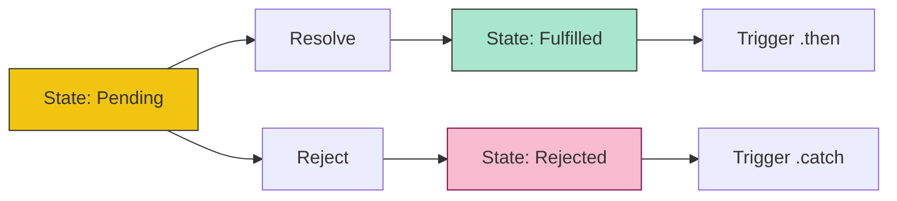

# CH-01: Control Abstractions and Promises

> **"Manajemen janji energi masa depan. `Control Abstractions and Promises` mendefinisikan sirkuit untuk mengelola keterlambatan dan kelanjutan asinkron."**

**Source Hub**: 
- [ECMA-262: Promise Objects](https://tc39.es/ecma262/#sec-promise-objects)
- [ECMA-262: Iteration and Generator Objects](https://tc39.es/ecma262/#sec-control-abstraction-objects)

---

## 1. Konsep & Esensi

**Definisi Arsitek**:
**Promise** adalah objek yang bertindak sebagai placeholder untuk hasil operasi asinkron yang belum selesai. Ia menjamin bahwa sirkuit *callback* akan dipanggil segera setelah energi tersedia atau gagal. **Iteration Objects** (Iterator) menyediakan protokol standar untuk mengonsumsi data satu per satu secara terkontrol.

**Model Mental**:
Bayangkan Anda memesan suku cadang di gudang Hub.
- **Promise**: Tiket antrean. Anda memegang tiket itu (Pending). Begitu suku cadang siap (Fulfilled) atau stok habis (Rejected), tiket itu akan memberi tahu Anda apa yang harus dilakukan selanjutnya (Then/Catch).

---

## 2. Visualisasi Sistem: Promise State Machine

---

## 3. Mekanisme & Hubungan

### Infrastruktur Asinkron (Clause 26)
1. **The Job Queue**: Saat sebuah Promise diselesaikan, Hub tidak langsung menjalankan `.then`. Ia memasukkan instruksi tersebut ke dalam **Microtask Queue** untuk dijalankan setelah sirkuit utama saat ini selesai.
2. **Promise.all vs Promise.race**: Algoritma untuk mengoordinasikan banyak sirkuit asinkron secara paralel. `all` menunggu semuanya sukses, sementara `race` memberikan energi kepada siapa pun yang sampai garis finish duluan.
3. **Iterators & Generators**: Objek pendamping yang memungkinkan fungsi "dijeda" secara struktural menggunakan metode `.next()`.

### Arsitek Mindset: Async Decoupling
- Gunakan Promise untuk memisahkan *definisi* logika asinkron dari *eksekusi* waktunya. Dengan pola ini, sirkuit Anda menjadi lebih bersih (menghindari Callback Hell) dan lebih mudah untuk diuji secara independen di Hub.

---

## 4. Lab Praktis
Buka file `examples/promise_concurrency_lab.js` untuk menguji perbedaan perilaku antara `Promise.all` dan `Promise.allSettled` saat salah satu sirkuit mengalami kegagalan.

---
*Status: [status.md](../../../../../status.md)*
