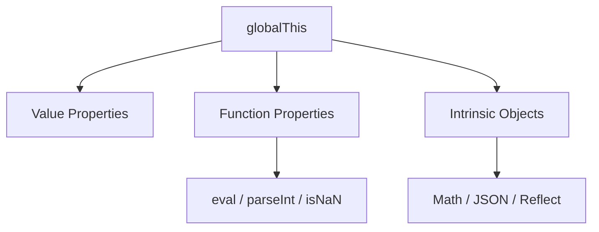

# CH-01: The Global Grid (Global Objects & Functions)

> **"Infrastruktur global yang selalu aktif sebelum program mulai berdenyut."**

**Source Hub**:
- [ECMA-262: The Global Object](https://tc39.es/ecma262/#sec-global-object)
- [ECMA-262: globalThis](https://tc39.es/ecma262/#sec-globalthis)

---

## 1. Mental Model: "The Built-in Utilities"

Global object adalah lapisan utilitas yang sudah tersedia bahkan sebelum kode aplikasi menambahkan apa pun:
- **`globalThis`** menyediakan titik masuk universal ke objek global lintas host.
- **Global functions** seperti `parseInt`, `isNaN`, dan `encodeURI` memberi layanan dasar yang bisa dipanggil dari mana saja.
- **`eval`** menunjukkan bahwa lapisan global juga memuat kemampuan paling berisiko bila dipakai tanpa disiplin.

---

## 2. Visualisasi Sistem: Global Utility Grid

---

## 3. Mekanisme & Hubungan

1. **Global object** dibentuk sebelum evaluasi program dan menjadi rumah bagi nilai, fungsi, dan objek bawaan yang harus selalu tersedia.
2. **`globalThis`** menormalkan akses lintas environment agar kode tidak perlu menebak `window`, `self`, atau `global`.
3. **Global functions** tampak sederhana, tetapi membawa konsekuensi semantik dan keamanan yang besar, terutama `eval`.

---

## 4. Lab Praktis

Buka file `examples/01_global_grid_lab.js` untuk membandingkan keberadaan utilitas global inti dan memverifikasi identitas `globalThis`.

---

## 5. Arsitek Mindset: Keamanan Grid

- Hindari penggunaan **`eval()`** untuk jalur aplikasi normal karena ia membuka jalur eksekusi teks arbitrer.
- Hindari menyimpan state aplikasi di `globalThis`; gunakan modul untuk dependency flow yang eksplisit.
- Perlakukan global object sebagai infrastruktur bersama, bukan tempat parkir state bisnis.

---
*Status: [x] Complete | [status.md](../../../docs/status.md)*
