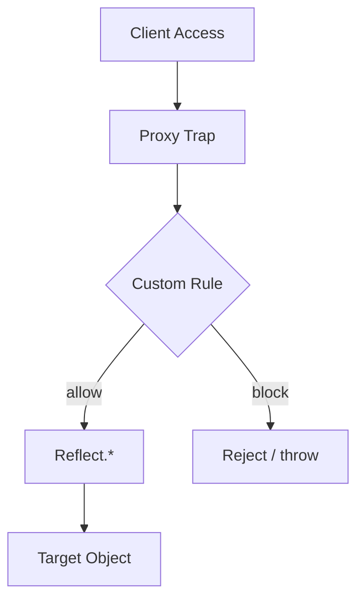

# CH-02: Reflective Hub (Proxy & Reflect)

> **"Lapisan intersepsi dan forwarding untuk operasi objek yang biasanya berjalan diam-diam."**

**Source Hub**:
- [ECMA-262: Proxy Objects](https://tc39.es/ecma262/#sec-proxy-objects)
- [ECMA-262: Reflection](https://tc39.es/ecma262/#sec-reflection)

---

## 1. Mental Model: "The Invisible Guard"

- **`Proxy`** adalah penjaga gerbang yang dapat memeriksa akses ke objek target.
- **`Reflect`** adalah toolkit forwarding resmi agar operasi tetap mengikuti semantik standar.
- Keduanya bekerja berpasangan: Proxy untuk intersepsi, Reflect untuk penerusan yang jujur.

---

## 2. Visualisasi Sistem: Trap and Forwarding Flow

---

## 3. Mekanisme & Hubungan

1. Proxy memberi titik intersepsi di atas operasi internal seperti `get` dan `set`.
2. Reflect menyediakan jalur forwarding yang konsisten dengan perilaku standar.
3. Invariants memastikan Proxy tidak dapat berbohong sembarangan tentang target.

---

## 4. Lab Praktis

Buka file `examples/01_proxy_demo.js` untuk melihat trap `get` dan `set` bekerja bersama `Reflect`.

---

## 5. Arsitek Mindset: Metaprogramming

- Gunakan Proxy ketika intersepsi benar-benar dibutuhkan, bukan sebagai default untuk semua objek.
- Gunakan Reflect saat Anda perlu meneruskan operasi tanpa menciptakan perilaku yang menyimpang.
- Ingat bahwa fleksibilitas meta-programming selalu datang dengan biaya performa dan kompleksitas.

---
*Status: [x] Complete | [status.md](../../../docs/status.md)*
