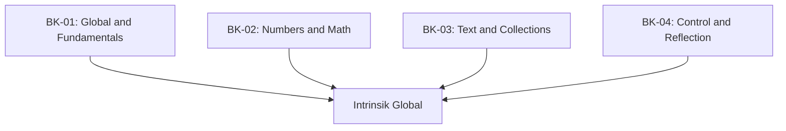

# SR-11: Standard Built-in Objects (The Global Intrinsics)

> **"Perpustakaan Dasar dan Logika Bawaan. SR-11 membedah 'Objek Bawaan Standar' (The Global Intrinsics)—sumber daya dasar yang selalu tersedia di dalam Grid."**

**Source Hub**: 
- [ECMA-262: Standard Built-in ECMAScript Objects](https://tc39.es/ecma262/#sec-standard-built-in-ecmascript-objects)

---

## 🏗️ The 4 Pillars of Global Intrinsics

---

## Koleksi Buku:
1.  **[BK-01: Global Object and Fundamentals](./BK-01_Fundamentals/)**: Objek Global, Object, Boolean, Symbol, dan sistem Error.
2.  **[BK-02: Numbers, BigInt, and Math](./BK-02_NumbersMath/)**: Perhitungan presisi, nilai BigInt, dan fungsi matematika Hub.
3.  **[BK-03: Text, Arrays, and Collections](./BK-03_Collections/)**: Pengolahan teks (String/RegExp) dan struktur data (Array/Map/Set).
4.  **[BK-04: Control Abstractions and Reflection](./BK-04_ControlReflect/)**: Aliran asinkron (Promise) dan alat introspeksi (Reflect/Proxy).

---
*Status: [status.md](../../status.md) | Back to [RAK-04](../README.md)*
