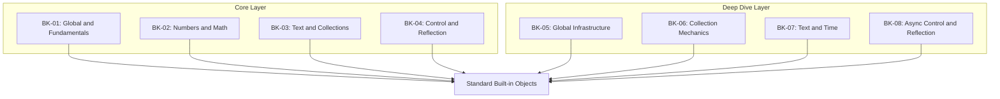

# SR-11: Standard Built-in Objects (The Global Intrinsics)

> **"Perpustakaan dasar dan logika bawaan yang selalu tersedia di dalam Grid."**

**Source Hub**:
- [ECMA-262: Standard Built-in ECMAScript Objects](https://tc39.es/ecma262/#sec-standard-built-in-ecmascript-objects)

---

## The 8-Book Built-in Architecture

---

## Koleksi Buku
1. **[BK-01: Global Object and Fundamentals](./BK-01_Fundamentals/)**: objek global, intrinsics fundamental, dan kontrak dasar objek bawaan.
2. **[BK-02: Numbers, BigInt, and Math](./BK-02_NumbersMath/)**: presisi numerik, `BigInt`, `Math`, dan `Date` sebagai built-ins komputasi.
3. **[BK-03: Text, Arrays, and Collections](./BK-03_Collections/)**: pemrosesan teks, `RegExp`, array, dan struktur koleksi modern.
4. **[BK-04: Control Abstractions and Reflection](./BK-04_ControlReflect/)**: `Promise`, `Reflect`, `Proxy`, dan abstraksi kontrol tingkat spec.
5. **[BK-05: Global Infrastructure](./BK-05_GlobalInfrastructure/)**: pendalaman utilitas global, `globalThis`, dan unit pemrosesan global yang selalu aktif.
6. **[BK-06: Collection Mechanics](./BK-06_CollectionMechanics/)**: pendalaman `Array`, TypedArray, `Map`, `Set`, dan weak collections.
7. **[BK-07: Text and Time](./BK-07_TextAndTime/)**: pendalaman engine teks, `RegExp`, dan sinkronisasi waktu berbasis `Date`.
8. **[BK-08: Async Control and Reflection](./BK-08_AsyncControlAndReflection/)**: pendalaman lifecycle `Promise`, microtask flow, `Reflect`, dan `Proxy`.

---

## Catatan Audit Struktur

`SR-11` kini diperlakukan sebagai sub-rak 8 buku:
- `BK-01` sampai `BK-04` adalah jalur inti yang merangkum domain built-ins utama.
- `BK-05` sampai `BK-08` adalah jalur pendalaman yang sebelumnya hidup sebagai struktur paralel dan kini dinormalisasi sebagai buku eksplisit agar tidak bentrok penomorannya.

---
*Status: [/] Partial | [status.md](../../status.md) | Back to [RAK-04](../README.md)*
