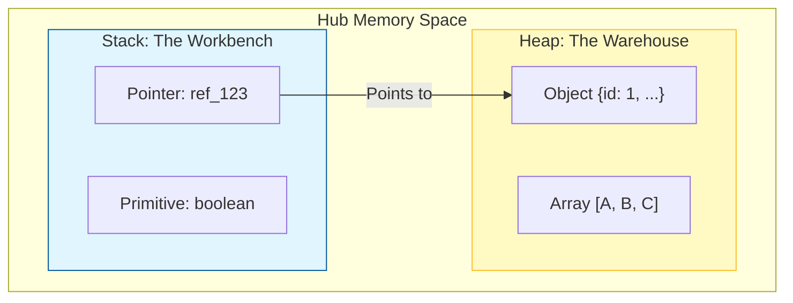

# CH-01: Memory Domains (Stack vs Heap)

> **"Setiap energi yang dialirkan ke Hub membutuhkan ruang penyimpanan yang sesuai dengan karakteristiknya. `Memory Domains` adalah 'Pembagian Wilayah Memori'—distribusi data antara Stack yang instan dan Heap yang luas."**

**Source Hub**: 
- [MDN: Memory Management](https://developer.mozilla.org/en-US/docs/Web/JavaScript/Memory_Management)
- [V8 Blog: Trash talk: the Orinoco garbage collector](https://v8.dev/blog/trash-talk)
- [ECMA-262: Memory Model](https://tc39.es/ecma262/#sec-memory-model)

---

## 1. Konsep & Esensi

**Definisi Arsitek**:
Hub mengelola memori dalam dua domain utama: **Stack** dan **Heap**. Pemilihan domain ini dilakukan secara otomatis oleh engine berdasarkan tipe data dan durasi hidup (*lifetime*) variabel tersebut di dalam Grid.

**Model Mental**:
- **Stack (Meja Kerja / Workbench)**: Tempat penyimpanan yang cepat, teratur, dan berukuran kecil. Digunakan untuk data primitif dan referensi pointer.
- **Heap (Gudang / Warehouse)**: Wilayah penyimpanan yang luas dan dinamis untuk objek kompleks dan sirkuit fungsi.

---

## 2. Visualisasi Sistem: Memory Distribution

---

## 3. Mekanisme & Hubungan

### Kaitan Stack & Heap
1. **LIFO (Last-In, First-Out)**: Stack bekerja dengan mekanisme tumpukan yang sangat cepat karena engine selalu tahu tepatnya berapa banyak memori yang dibutuhkan.
2. **Dynamic Allocation**: Heap dialokasikan secara dinamis saat runtime. Engine tidak tahu ukuran objek di Heap sampai objek tersebut benar-benar terbentuk.
3. **Reference Links**: Variabel di Stack seringkali hanya berisi "alamat" (pointer) yang menunjuk ke lokasi data sebenarnya di dalam Heap.

### Arsitek Mindset: Kesadaran Ruang
- Data di **Stack** dibersihkan secara instan begitu fungsi selesai dijalankan.
- Data di **Heap** harus menunggu siklus **Garbage Collection (GC)** untuk dibersihkan, yang bisa memakan sedikit daya komputasi Hub.

---

## 4. Lab Praktis
Buka file `examples/memory_distribution_lab.js` untuk melihat bagaimana penumpukan data di Stack berbeda dengan alokasi di Heap melalui visualisasi log memori sirkuit.

---
*Status: [status.md](../../../../../status.md)*
