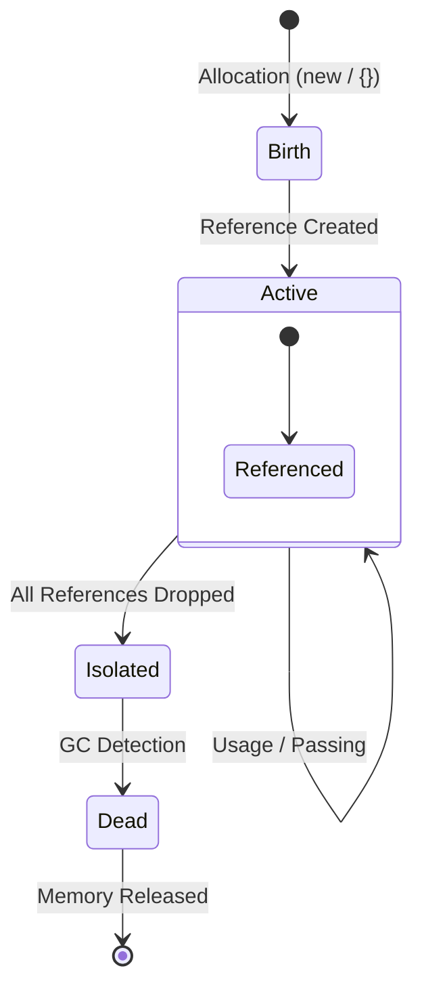

# CH-02: Object Vitality (Creation to Death)

> **"Energi tidak pernah hilang, ia hanya berubah bentuk atau didaur ulang. `Object Vitality` adalah 'Siklus Hidup Objek'—perjalanan sebuah unit data dari saat ia dilahirkan di Heap hingga ia dihancurkan oleh sistem pembersihan Hub."**

**Source Hub**: 
- [MDN: JavaScript Memory Management](https://developer.mozilla.org/en-US/docs/Web/JavaScript/Memory_Management)
- [ECMA-262: Objects](https://tc39.es/ecma262/#sec-objects)
- [V8: Garbage Collection](https://v8.dev/docs/garbage-collection)

---

## 1. Konsep & Esensi

**Definisi Arsitek**:
Setiap objek kompleks di JavaScript memiliki siklus hidup yang dimulai dari alokasi memori di **Heap** dan berakhir dengan pembebasan memori oleh **Garbage Collector (GC)**. Kesadaran akan siklus ini krusial bagi arsitek untuk mencegah kebocoran energi (*Memory Leaks*).

**Model Mental**:
Bayangkan sebuah unit sensor yang baru dipasang di Grid. Unit itu aktif selama masih ada kabel (referensi) yang terhubung ke pusat kendali. Begitu kabel terakhir diputus, unit tersebut mati dan akan diambil oleh tim daur ulang Hub.

---

## 2. Visualisasi Sistem: Alur Siklus Hidup

---

## 3. Mekanisme & Hubungan

### Fase Vitalitas Objek
1. **Allocation (Birth)**: Terjadi saat `new`, `Object.create()`, atau literal `{}` dipanggil. Engine memesan blok memori di Heap.
2. **Connectivity (Activity)**: Objek tetap "hidup" selama ia masih bisa dijangkau (*reachable*) dari **GC Roots** (Global object, current stack frames, dll).
3. **Isolation**: Terjadi saat semua variabel yang menunjuk ke objek tersebut di-set ke `null` atau keluar dari scope.
4. **Collection**: GC secara periodik memindai Heap untuk menemukan objek terisolasi dan mengosongkan memorinya.

### Arsitek Mindset: Memutus Koneksi
- **Kebocoran Energi**: Terjadi saat Anda membiarkan referensi tetap hidup (misal: di variabel Global atau Event Listener yang tidak dicabut) padahal objeknya sudah tidak dibutuhkan.
- Gunakan `null` secara eksplisit untuk membantu GC mempercepat proses isolasi pada objek-objek besar.

---

## 4. Lab Praktis
Buka file `examples/object_lifecycle_lab.js` untuk memantau siklus hidup objek menggunakan `FinalizationRegistry` dan melihat kapan tepatnya Hub melakukan daur ulang memori.

---
*Status: [status.md](../../../../../status.md)*
