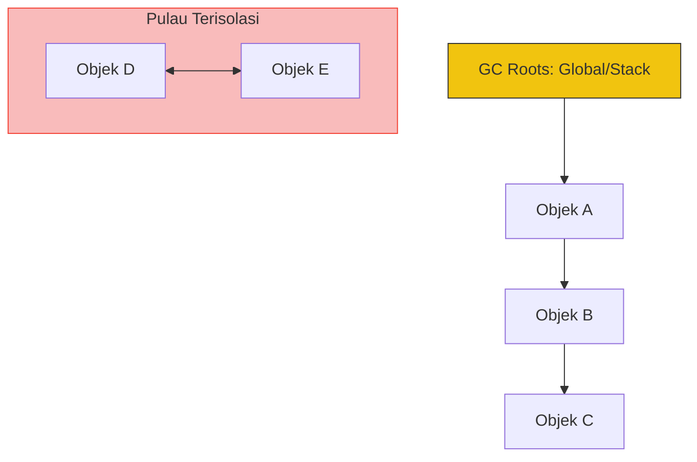

# CH-01: Reachability Atlas (The Connectivity Rule)

> **"Hub tidak akan menghancurkan apa pun yang masih memiliki jalur koneksi ke pusat kendali. `Reachability Atlas` adalah 'Aturan Konektivitas'—protokol yang menentukan apakah sebuah objek masih dianggap 'Dapat Dijangkau' atau sudah menjadi 'Isolasi'."**

**Source Hub**: 
- [MDN: Garbage Collection](https://developer.mozilla.org/en-US/docs/Web/JavaScript/Memory_Management#garbage_collection)
- [V8 Blog: Visualizing GC](https://v8.dev/blog/free-garbage-collection)
- [ECMA-262: Reachability](https://tc39.es/ecma262/#sec-reachability)

---

## 1. Konsep & Esensi

**Definisi Arsitek**:
Dalam memori Hub, objek dianggap "hidup" selama ada jalur referensi yang valid dari **GC Roots**. **Reachability** adalah algoritma penelusuran graf di mana engine menelusuri semua objek yang terhubung untuk memastikan tidak ada data aktif yang terbuang.

**Model Mental**:
Bayangkan pusat kendali Hub sebagai "Akar" (Roots). Selama sebuah unit sensor masih terhubung kabel ke pusat atau ke unit lain yang terhubung ke pusat, unit itu aman. Jika kabelnya putus dan unit itu terisolasi di "Pulau" (Island), tim GC akan mendeteksinya.

---

## 2. Visualisasi Sistem: Connectivity Graph

---

## 3. Mekanisme & Hubungan

### Titik Awal (GC Roots)
1. **Global Object**: Variabel di `window` atau `globalThis`.
2. **Current Stack**: Variabel lokal dalam fungsi yang sedang dieksekusi.
3. **Module Records**: Impor/Ekspor yang aktif dalam sistem modul.

### Aturan Konektivitas
- **Direct Reachability**: Objek yang ditunjuk langsung oleh Root.
- **Transitive Reachability**: Objek yang ditunjuk oleh objek yang dapat dijangkau.
- **Circular Islands**: Meskipun dua objek saling merujuk (A <-> B), jika keduanya tidak terhubung ke Root, maka keduanya tetap dianggap tidak terjangkau (*Unreachable*).

---

## 4. Lab Praktis
Buka file `examples/reachability_lab.js` untuk melihat bagaimana penghapusan referensi pada node pusat mengakibatkan seluruh cabang objek menjadi tidak terjangkau dalam satu siklus GC.

---
*Status: [status.md](../../../../../status.md)*
