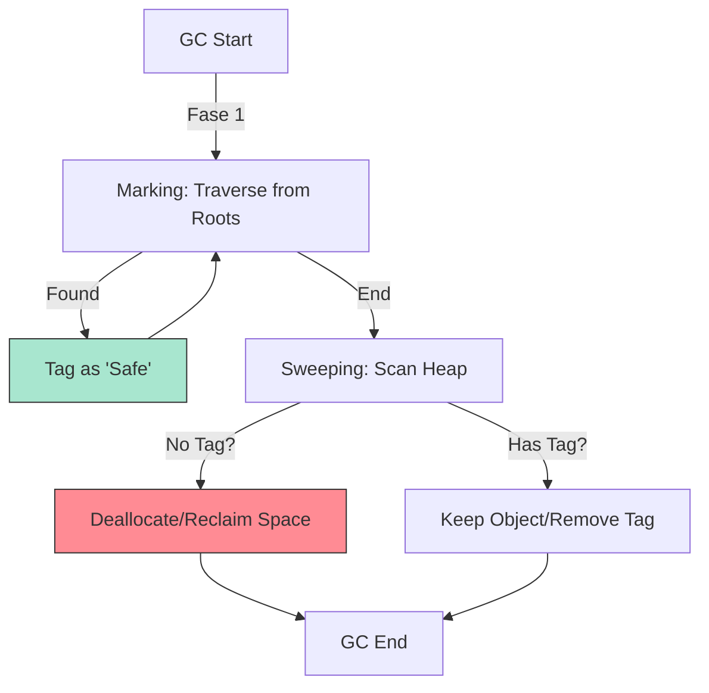

# CH-02: Sweeping Protocols (How GC Cleans Up)

> **"Setelah atlas pemetaan selesai, tim pembersih mulai bergerak. `Sweeping Protocols` adalah 'Protokol Pembersihan'—algoritma otonom yang membebaskan ruang Warehouse dari objek-objek terisolasi tanpa menghentikan aliran energi utama."**

**Source Hub**: 
- [V8: Garbage Collection (Orinoco)](https://v8.dev/blog/trash-talk)
- [MDN: Mark-and-sweep algorithm](https://developer.mozilla.org/en-US/docs/Web/JavaScript/Memory_Management#mark-and-sweep_algorithm)
- [ECMA-262: Garbage Collection (Intro)](https://tc39.es/ecma262/#sec-memory-model)

---

## 1. Konsep & Esensi

**Definisi Arsitek**:
Meskipun setiap mesin JavaScript (V8, SpiderMonkey) memiliki optimasi unik, protokol dasarnya adalah **Mark-and-Sweep**. Ini adalah proses dua fase: menandai objek aktif dan menyapu objek mati untuk mengklaim kembali ruang memori di Heap.

**Model Mental**:
Bayangkan tim pembersih Hub berjalan membawa stiker "Safe" (Aman). Mereka menempelkan stiker pada setiap unit yang masih terhubung ke kabel Roots. Setelah selesai, semua unit yang tidak memiliki stiker akan dihancurkan dan areanya dibersihkan.

---

## 2. Visualisasi Sistem: Mark-and-Sweep Flow

---

## 3. Mekanisme & Hubungan

### Generational Collection (Optimasi V8)
Hub modern membagi Warehouse (Heap) menjadi dua wilayah:
- **Young Generation (Nursery)**: Tempat objek baru dilahirkan. Dibersihkan sangat sering (Minor GC).
- **Old Generation**: Objek yang selamat dari beberapa siklus pembersihan dipindahkan ke sini. Dibersihkan lebih jarang (Major GC) karena dianggap lebih stabil.

### Arsitek Mindset: Membantu Tim Pembersih
- **Invisible Cleanup**: Anda tidak bisa memicu `gc()` secara manual dalam spek standar. Hub memutuskan sendiri kapan harus membersihkan.
- **Closure Awareness**: Hati-hati dengan **Closures**. Jika sebuah fungsi menahan referensi ke objek masif, objek tersebut tidak akan pernah bisa ditandai sebagai "Safe" untuk dihapus selama fungsi tersebut masih aktif.

---

## 4. Lab Praktis
Buka file `examples/sweeping_protocols_lab.js` untuk mensimulasikan beban memori dan melihat bagaimana performa Hub berfluktuasi saat siklus pembersihan otomatis aktif.

---
*Status: [status.md](../../../../../status.md)*
