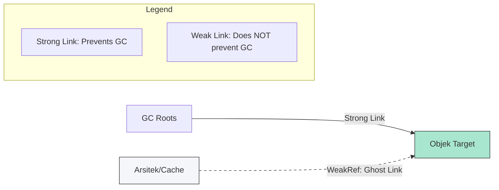

# CH-01: Ghost Connections (WeakRef)

> **"Terkadang kita perlu memantau sebuah unit energi tanpa harus menahan keberadaannya di Grid. `Ghost Connections` adalah 'Referensi Lemah' (WeakRef)—jalur pantau yang tidak dihitung sebagai koneksi kabel keras oleh tim pembersih Hub."**

**Source Hub**: 
- [MDN: WeakRef](https://developer.mozilla.org/en-US/docs/Web/JavaScript/Reference/Global_Objects/WeakRef)
- [ECMA-262: WeakRef Objects](https://tc39.es/ecma262/#sec-weak-ref-objects)
- [V8: WeakRefs and FinalizationRegistry](https://v8.dev/features/weak-references)

---

## 1. Konsep & Esensi

**Definisi Arsitek**:
Sebuah **`WeakRef`** (Weak Reference) memungkinkan Anda memegang referensi ke sebuah objek tanpa mencegah objek tersebut dihancurkan oleh **Garbage Collector (GC)**. Jika objek tersebut didaur ulang, `WeakRef` akan secara otomatis kehilangan targetnya.

**Model Mental**:
Bayangkan sebuah kabel hantu yang terhubung ke unit sensor. Kabel ini bisa Anda gunakan untuk melihat status sensor, tetapi tim pembersih Hub tidak menganggap kabel ini sebagai beban yang harus dipertahankan. Jika sirkuit lain tidak ada yang terhubung ke sensor itu, sensor akan diambil, dan kabel hantu Anda akan terputus secara otomatis.

---

## 2. Visualisasi Sistem: Ghost Link Connectivity

---

## 3. Mekanisme & Hubungan

### Cara Kerja Jalur Hantu
1. **`new WeakRef(target)`**: Menciptakan koneksi hantu ke objek target.
2. **`deref()`**: Digunakan untuk mencoba mendapatkan kembali objek target. Jika objek masih hidup, ia mengembalikan objek; jika sudah mati, ia mengembalikan `undefined`.
3. **Ghost State**: Keadaan di mana objek sudah diklaim oleh GC tetapi `deref()` mungkin belum mengembalikan `undefined` secara instan (tergantung pada siklus internal engine).

### Arsitek Mindset: Caching & Metadata
- **Caching**: Gunakan `WeakRef` untuk cache objek besar yang bisa dibuat ulang jika hilang. Ini mencegah memory leak pada sistem cache yang tidak dibersihkan secara manual.
- **Metadata**: Gunakan untuk menyimpan informasi tambahan tentang objek tanpa memperpanjang hidup objek tersebut.

---

## 4. Lab Praktis
Buka file `examples/weak_ref_lab.js` untuk melihat bagaimana sebuah objek di dalam cache `WeakRef` menghilang setelah semua referensi kuatnya diputus dan GC dipicu.

---
*Status: [status.md](../../../../../status.md)*
