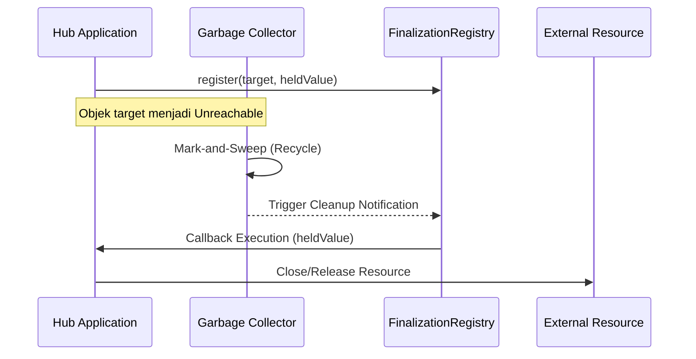

# CH-02: Post-Mortem Cleanup (FinalizationRegistry)

> **"Saat sebuah unit energi benar-benar dihancurkan, Hub mungkin perlu menjalankan protokol penutupan formal. `Post-Mortem Cleanup` adalah 'Registri Finalisasi' (FinalizationRegistry)—mekanisme untuk mendaftarkan callback yang akan dipicu oleh Hub setelah objek didaur ulang."**

**Source Hub**: 
- [MDN: FinalizationRegistry](https://developer.mozilla.org/en-US/docs/Web/JavaScript/Reference/Global_Objects/FinalizationRegistry)
- [ECMA-262: FinalizationRegistry Objects](https://tc39.es/ecma262/#sec-finalization-registry-objects)
- [V8: FinalizationRegistry and Cleanup](https://v8.dev/features/weak-references#finalizationregistry)

---

## 1. Konsep & Esensi

**Definisi Arsitek**:
**`FinalizationRegistry`** memungkinkan Anda mendaftarkan sebuah *callback* yang akan dijalankan oleh engine setelah sebuah objek yang didaftarkan telah diklaim oleh **Garbage Collector**. Ini adalah protokol terakhir (post-mortem) untuk membersihkan sumber daya luar yang terkait dengan objek tersebut.

**Model Mental**:
Bayangkan Anda memiliki unit generator eksternal (di luar Hub utama) yang memerlukan penutupan katup manual saat unit generator internal (di dalam Hub) dihancurkan. Anda menitipkan pesan pada tim pembersih: "Jika unit internal ini kalian daur ulang, tolong beri tahu saya agar saya bisa menutup katup unit eksternalnya."

---

## 2. Visualisasi Sistem: Cleanup Registry Flow

---

## 3. Mekanisme & Hubungan

### Kapan Callback Dipicu?
- **Asinkron**: Tidak ada jaminan waktu yang tepat. Hub biasanya menunggu hingga tugas utama selesai sebelum memproses antrean finalisasi.
- **Held Value**: Nilai yang Anda teruskan (bisa berupa ID string atau objek lain) untuk memberi tahu callback sumber daya mana yang harus dibersihkan.
- **Unregister**: Anda bisa membatalkan pendaftaran (*unregister*) jika sumber daya sudah dibersihkan secara manual sebelum objek didaur ulang.

### Arsitek Mindset: Jaring Pengaman
- **Jangan diandalkan**: Jangan gunakan untuk logika bisnis kritis yang membutuhkan durasi pembersihan instan (seperti menutup koneksi DB). Gunakan `try...finally`.
- **Side effects**: Hindari membuat objek baru atau menahan referensi baru di dalam callback, karena ini bisa merusak siklus GC berikutnya.

---

## 4. Lab Praktis
Buka file `examples/finalization_registry_lab.js` untuk melihat bagaimana callback post-mortem dipicu setelah sebuah objek sensor buatan dianggap mati oleh Hub.

---
*Status: [status.md](../../../../../status.md)*
