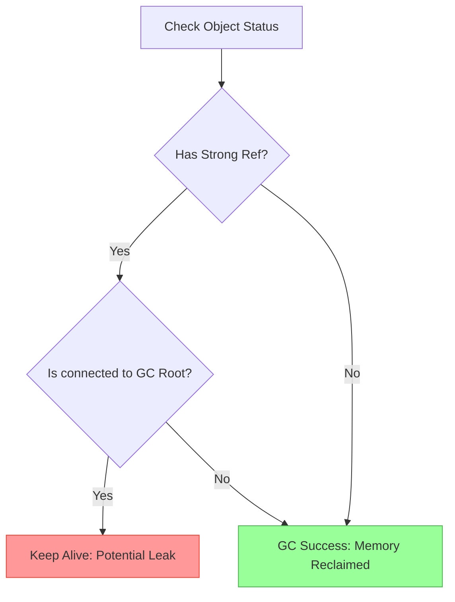

# CH-01: Energy Leaks (Common Scenarios)

> **"Kebocoran energi tidak selalu terjadi karena kesalahan Hub, melainkan karena desain sirkuit yang buruk. `Energy Leaks` adalah 'Kebocoran Memori'—skenario di mana objek tetap hidup di Warehouse meskipun sudah tidak dibutuhkan lagi."**

**Source Hub**: 
- [MDN: Common JavaScript memory leaks](https://developer.mozilla.org/en-US/docs/Web/JavaScript/Memory_Management#garbage_collection)
- [Chrome DevTools: Fix memory problems](https://developer.chrome.com/docs/devtools/memory-problems/)
- [V8: Memory terminology](https://v8.dev/docs/memory-terminology)

---

## 1. Konsep & Esensi

**Definisi Arsitek**:
Kebocoran Memori (*Memory Leak*) terjadi saat pengembang secara tidak sengaja mempertahankan referensi (**Strong Reference**) ke sebuah objek yang seharusnya sudah tidak digunakan lagi. Karena referensi tersebut masih ada, **Garbage Collector** tidak bisa mengklaim kembali memori tersebut, yang akhirnya menyebabkan penurunan performa Hub (Grid Slowdown).

**Model Mental**:
Bayangkan pipa air di Hub yang tersumbat. Air (memori) terus mengalir masuk, tetapi tidak pernah keluar karena ada penyumbat (referensi yang tertinggal). Semakin banyak pipa yang tersumbat, semakin sedikit daya yang tersedia untuk sistem lainnya.

---

## 2. Visualisasi Sistem: Leak Detection Flow

---

## 3. Mekanisme & Hubungan

### Skenario Kebocoran Utama
1. **Accidental Globals**: Menggunakan variabel tanpa deklarasi (`let/const`) sehingga menjadi properti `globalThis`. Global adalah Root yang abadi.
2. **Forgotten Timers**: `setInterval` yang terus berjalan dan memegang referensi ke objek besar di dalam closure-nya.
3. **Uncleared Event Listeners**: Menambahkan listener pada elemen Grid dan lupa mencabutnya (`removeEventListener`) saat elemen tersebut dihancurkan.
4. **Closures Overload**: Fungsi inner yang menahan variabel dari fungsi outer yang sangat besar, menghambat siklus hidup normal variabel tersebut.

### Arsitek Mindset: Disiplin Sirkuit
- **Strict Mode**: Gunakan `'use strict'` untuk mencegah terciptanya global secara tidak sengaja.
- **Cleanup Phase**: Selalu sediakan fase pembersihan (seperti `destroy()` atau `cleanup()`) pada setiap komponen Hub yang kompleks.

---

## 4. Lab Praktis
Buka file `examples/energy_leak_scenarios.js` untuk mensimulasikan berbagai kebocoran memori (Global, Timers, Closures) dan melihat bagaimana penggunaan memori Heap terus meningkat tanpa henti.

---
*Status: [status.md](../../../../../status.md)*
