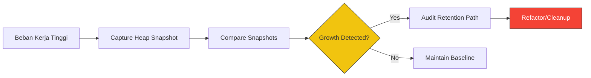

# CH-02: Efficiency Audits (Best Practices)

> **"Hub yang sehat adalah Hub yang hemat daya. `Efficiency Audits` adalah 'Audit Efisiensi'—kumpulan praktik terbaik untuk memastikan penggunaan memori tetap minimum dan performa Hub tetap maksimal."**

**Source Hub**: 
- [Chrome DevTools: Memory profiling](https://developer.chrome.com/docs/devtools/memory-problems/heap-snapshots/)
- [V8: Fast properties](https://v8.dev/blog/fast-properties)
- [ECMA-262: Memory Safety](https://tc39.es/ecma262/#sec-memory-model)

---

## 1. Konsep & Esensi

**Definisi Arsitek**:
Efisiensi memori bukan hanya tentang memperbaiki kebocoran, tetapi tentang mendesain sirkuit yang sedari awal hemat tempat. Audit Efisiensi melibatkan pemantauan periodik terhadap **Heap Snapshot** dan **Allocation Timeline** untuk mengidentifikasi "Hot Spots" di mana memori terbuang percuma.

**Model Mental**:
Bayangkan merancang panel kontrol Hub agar setiap sirkuit hanya menggunakan kabel seperlunya. Jangan gunakan kabel tembaga tebal (objek besar) untuk tugas yang bisa diselesaikan dengan kawat tipis (primitif).

---

## 2. Visualisasi Sistem: Profiling Audit Flow

---

## 3. Mekanisme & Hubungan

### Strategi Penghematan Energi
1. **Object Pooling**: Gunakan kembali objek lama untuk tugas yang berulang (misal: partikel grafik) daripada terus menciptakan objek baru yang harus dibersihkan GC.
2. **Shallow vs Deep Trees**: Hindari struktur objek yang terlalu dalam (*deeply nested*) karena memperberat tugas penelusuran **Mark-and-Sweep**.
3. **Lazy Allocation**: Jangan deklarasikan data besar di awal aplikasi jika data tersebut hanya dibutuhkan saat event tertentu dipicu.

### Arsitek Mindset: Kesadaran Lanjutan
- **Premature Optimization**: Jangan mengoptimasi sebelum ada data profiling yang membuktikan ada masalah. Tulis kode yang bersih/terbaca dulu.
- **GC Overhead**: Sadari bahwa setiap kali GC berjalan, aliran energi (CPU) akan teralih sejenak. Minimalkan "sampah" untuk meminimalkan jeda (*Jank*).

---

## 4. Lab Praktis
Buka file `examples/memory_profiling_lab.js` untuk berlatih membaca profil memori menggunakan `process.memoryUsage()` dan mengidentifikasi anomali pertumbuhan Heap secara real-time.

---
*Status: [status.md](../../../../../status.md)*
