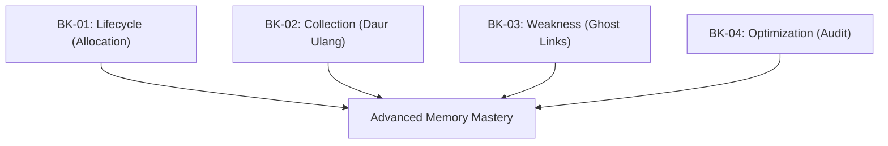

# SR-12: Memory Management and GC (The Recycling System)

> **"Sebuah Hub yang efisien adalah Hub yang mampu membersihkan sisa-sisa energinya sendiri. SR-12 membedah 'Sistem Daur Ulang' (The Recycling System)—mekanisme alokasi memori dan pembersihan otomatis (Garbage Collection) yang menjaga ketersediaan sumber daya Grid."**

**Source Hub**: 
- [MDN: JavaScript Memory Management](https://developer.mozilla.org/en-US/docs/Web/JavaScript/Memory_Management)
- [V8: Garbage Collection Docs](https://v8.dev/docs/garbage-collection)
- [ECMA-262: Memory Model](https://tc39.es/ecma262/#sec-memory-model)

---

## 🏗️ The 4 Memory Pillars

---

## Koleksi Buku:
1.  **[BK-01: Allocation and Lifecycle](./BK-01_AllocationAndLifecycle/)**: Membedah pembagian domain memori (Stack vs Heap).
2.  **[BK-02: Garbage Collection](./BK-02_GarbageCollection/)**: Mekanisme pencarian objek terisolasi melalui atlas konektivitas.
3.  **[BK-03: Weak References](./BK-03_WeakReferences/)**: Penggunaan referensi hantu untuk memantau tanpa menahan energi.
4.  **[BK-04: Memory Optimization](./BK-04_MemoryOptimization/)**: Strategi pencegahan kebocoran energi dan audit efisiensi.

---
*Status: [status.md](../../status.md) | Back to [RAK-04](../README.md)*
