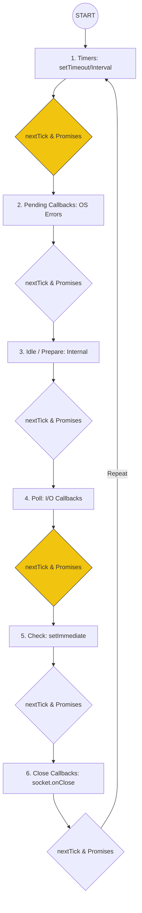

# CH-01: Event Loop (Phases & Timers)

Event Loop adalah jantung dari Node.js yang memungkinkan eksekusi asinkronus non-blocking meskipun berada di lingkungan single-threaded JavaScript.

## 🎡 The Ferris Wheel Architecture
Event Loop bekerja dalam siklus yang terdiri dari beberapa fase. Antara setiap fase, Node.js akan mengecek dan mengosongkan antrean microTask.

## 🔄 Fase Detail
1. **Timers**: Mengeksekusi callback yang telah melewati ambang batas waktu.
2. **Pending Callbacks**: Menangani kegagalan sistem operasional (seperti TCP error).
3. **Poll**: Fase krusial tempat Node.js mengambil event I/O baru dan memblokir sementara jika tidak ada kerjaan lain.
4. **Check**: Dirancang khusus untuk mengeksekusi callback `setImmediate()` segera setelah fase Poll selesai.

## ⚡ microTask Queue (The Special Pass)
Berbeda dengan fase di atas, antrean ini dieksekusi **sesegera mungkin** setelah operasi saat ini selesai, tanpa menunggu fase berikutnya.
- **Priority 1**: `process.nextTick()` (Bukan bagian dari Event Loop, tapi dieksekusi sebelum transisi fase).
- **Priority 2**: `Promise.then()` (Microtask queue standar).

> [!IMPORTANT]
> **Internalist Insight**: Jika Anda terus-menerus memanggil `process.nextTick()` secara rekursif, Event Loop akan "kelaparan" (starve) karena ia tidak akan pernah bisa melanjutkan ke fase Timers atau Poll.

---
*Lihat Lab: [Urutan Eksekusi](./examples/event_loop_order.js)*  
*Kembali ke [BK-01](../README.md)*
