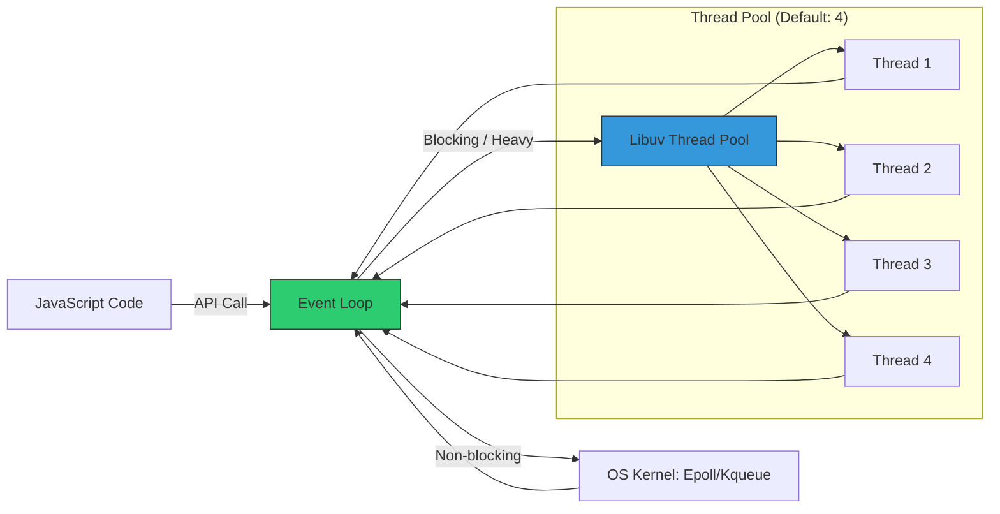

# CH-02: Libuv Thread Pool (I/O & Worker Threads)

Node.js menggunakan **Libuv** sebagai jembatan ke sistem operasi. Meskipun JavaScript *single-threaded*, Libuv memiliki "pelayan" tambahan berupa kumpulan thread (Thread Pool).

## 🏗️ The Bridge Architecture
Event Loop tidak pernah melakukan tugas yang memakan waktu lama secara langsung. Ia mendelegasikan tugas tersebut ke Libuv.

## 📋 Tugas Thread Pool
Hanya beberapa jenis operasi yang dikirim ke Thread Pool:
1. **Cryptography**: `crypto.pbkdf2()`, `randomBytes()`.
2. **FileSystem**: `fs.*` (kecuali yang bersifat internal).
3. **Zlib**: Operasi kompresi/dekompresi.
4. **DNS**: `dns.lookup()`.

## 🚀 Optimasi: UV_THREADPOOL_SIZE
Jika aplikasi Anda melakukan banyak enkripsi atau pemrosesan gambar secara simultan, 4 thread default mungkin menjadi bottleneck. Anda bisa meningkatkannya (maksimal 1024):

- **Windows**: `SET UV_THREADPOOL_SIZE=8 && node app.js`
- **Linux/Mac**: `UV_THREADPOOL_SIZE=8 node app.js`

> [!WARNING]
> **Starvation**: Menyetel thread pool terlalu tinggi pada CPU dengan core sedikit dapat menyebabkan overhead *context switching* yang merugikan performa.

---
*Lihat Lab: [Tes Stress Thread Pool](./examples/threadpool_stress.js)*  
*Kembali ke [BK-01](../README.md)*
