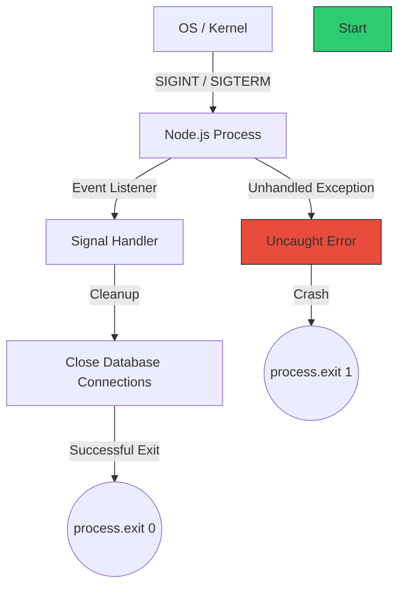

# CH-03: Process & OS Integration

Node.js memberikan kontrol tingkat rendah terhadap sistem operasi melalui API global `process` dan modul `os`.

## 🚦 Process Lifecycle & Signals
Sistem operasi berkomunikasi dengan Node.js melalui sinyal (Signals). Menangani sinyal ini penting untuk **Graceful Shutdown**.

## 🛠️ Interaksi OS Utama
1. **Environment Variables**: Mengakses rahasia atau konfigurasi melalui `process.env`.
2. **Resource Metrics**: Memantau RAM dan CPU melalui `process.memoryUsage()` dan `process.cpuUsage()`.
3. **Platform Check**: Mengetahui sistem operasi (Windows, Linux, Darwin) via `process.platform`.
4. **Standard Streams**: Berinteraksi dengan input/output terminal via `process.stdout` dan `process.stdin`.

## 🔄 IPC (Inter-Process Communication)
Saat Anda membuat "Child Process", Node.js dapat membuka saluran pipa komunikas (Channels) untuk saling mengirim pesan JSON tanpa melewati network overhead.

> [!IMPORTANT]
> **Internalist Insight**: `process.exit(0)` menandakan program selesai dengan sukses. Angka lain (seperti `1`) menandakan terjadi error. Ini digunakan oleh tools seperti Docker atau Orchestrator untuk menentukan apakah container perlu di-restart.

---
*Lihat Lab: [Penanganan Sinyal](./examples/process_signals.js)*  
*Kembali ke [BK-01](../README.md)*
