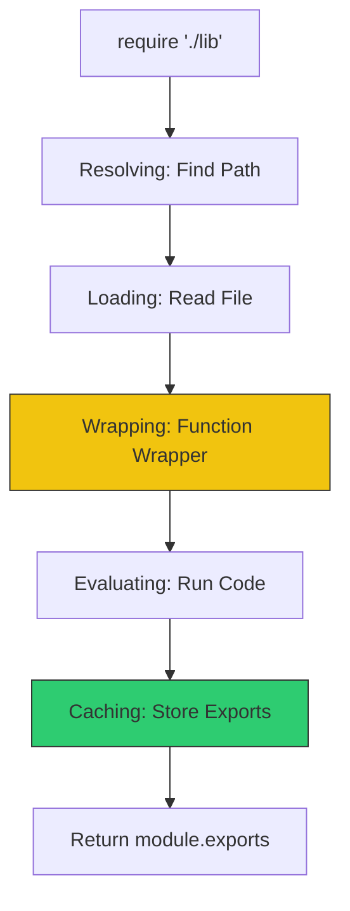

# CH-01: CommonJS (Node.js Legacy)

CommonJS (CJS) adalah sistem modul standar yang lahir bersama Node.js untuk menangani dependensi di sisi server sebelum ECMAScript Modules (ESM) ada.

## 🏗️ Mekanisme Require
CJS bekerja secara **sinkronus**. Ketika Anda memanggil `require()`, eksekusi kode akan berhenti sampai modul selesai dimuat.



## 📦 The Module Wrapper
Diam-diam, Node.js membungkus kode Anda dalam fungsi berikut:
```javascript
(function(exports, require, module, __filename, __dirname) {
    // KODE ANDA DI SINI
});
```
Inilah mengapa variabel seperti `__dirname` tersedia meskipun Anda tidak mendefinisikannya.

> [!IMPORTANT]
> **Single Instance**: Karena adanya sistem **Caching**, memanggil `require()` berkali-kali untuk file yang sama tidak akan menjalankan ulang kodenya. Node.js hanya akan mengembalikan referensi ke objek yang sama.

---
*Lihat Lab: [Demo CJS](./examples/cjs_demo.js)*  
*Kembali ke [BK-02](../README.md)*
