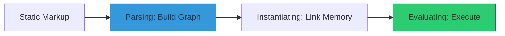

# CH-02: ECMAScript Modules (The New Standard)

ESM adalah sistem modul resmi standar JavaScript (ECMA) yang mulai diadopsi oleh Node.js sejak versi 12+.

## ⚡ Asynchronous Loading
Berbeda dengan CJS, ESM memisahkan fase *parsing* dan *execution*. Ini memungkinkan engine melakukan optimasi seperti **Tree Shaking** (membuang kode yang tidak terpakai).

## 🌟 Fitur Unggulan
1. **Top-level Await**: Anda dapat menggunakan `await` di luar fungsi `async` (hanya di `.mjs` atau project tipe module).
2. **Static Import**: Dependensi harus dideklarasikan di awal file, memudahkan tool analisis.
3. **No Wrapper**: Tidak ada `__dirname` atau `require`. Anda harus menggunakan `import.meta.url`.

> [!TIP]
> **Performance**: Karena struktur ESM bersifat statis, bundler seperti Webpack atau Rollup dapat menganalisis modul Anda tanpa harus menjalankan kodenya sama sekali.

---
*Lihat Lab: [Demo ESM](./examples/esm_demo.mjs)*  
*Kembali ke [BK-02](../README.md)*
