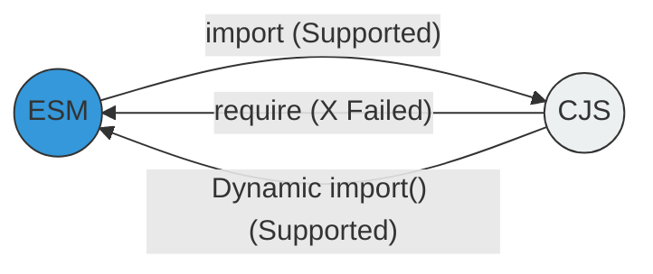

# CH-03: Interoperability (Bridging the Gap)

Bagaimana CJS dan ESM hidup berdampingan? Node.js menyediakan mekanisme "jembatan" untuk migrasi bertahap.

## 🌉 The Rules of Attraction
Ada aturan ketat tentang siapa yang bisa memanggil siapa:

1. **ESM can import CJS**: Dapat dilakukan dengan `import` standar atau `createRequire`.
2. **CJS cannot import ESM**: Karena ESM bersifat asinkronus sedangkan `require` sinkronus. Satu-satunya cara adalah menggunakan `dynamic import()`.



## 🛠️ Strategi Dual-Stack
Banyak pembuat library menyediakan dua versi sekaligus menggunakan field `exports` di `package.json`:
```json
"exports": {
  "import": "./dist/index.mjs",
  "require": "./dist/index.cjs"
}
```

> [!WARNING]
> **Dual-Package Hazard**: Jika sebuah aplikasi mengimpor library yang sama via CJS dan ESM sekaligus, Node.js akan menganggap keduanya sebagai modul yang berbeda, yang bisa menyebabkan bug status singleton (misal: dua instance database global).

---
*Lihat Lab: [Demo Interop](./examples/interop_demo.mjs)*  
*Kembali ke [BK-02](../README.md)*
