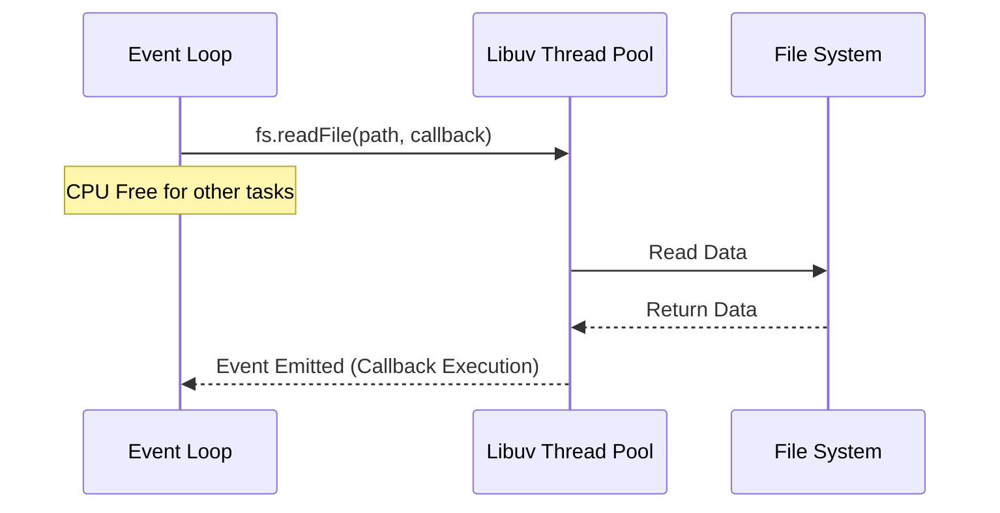

# CH-01: File System (The I/O Engine)

Hampir setiap aplikasi Node.js berinteraksi dengan sistem file. Modul `fs` menyediakan API untuk ini dalam dua varian: Sync dan Async.

## 🧱 Blocking vs Non-Blocking
Node.js menggunakan Libuv Thread Pool untuk melakukan operasi file secara asinkron agar tidak menghentikan arus utama program.

## 📂 API Varian
1. **Callback API**: Tradisional, menggunakan `(err, data) => {}`.
2. **Synchronous API**: Memblokir eksekusi. Hindari di server production!
3. **Promises API**: Modern, dapat digunakan dengan `async/await`.

> [!TIP]
> **Performance**: Untuk file yang sangat besar, jangan gunakan `readFile` (yang memuat semuanya ke RAM). Gunakan `fs.createReadStream` untuk memproses data secara bertahap.

---
*Lihat Lab: [Demo FS Ops](./examples/fs_ops.js)*  
*Kembali ke [BK-03](../README.md)*
