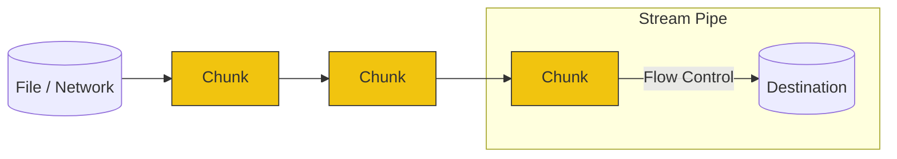

# CH-02: Buffers & Streams (The Data Conveyor)

Menangani data besar di Node.js memerlukan strategi agar tidak membebani memori (RAM). Di sinilah **Buffers** dan **Streams** berperan.

## 📦 Buffers vs 🌊 Streams
- **Buffer**: Penampung sementara untuk data biner (dalam bentuk Array of Bytes). Cocok untuk data kecil yang sudah diketahui ukurannya.
- **Stream**: Urutan data yang tersedia seiring waktu. Cocok untuk data raksasa atau data yang belum selesai diunduh.

## 🛠️ Jenis Stream
1. **Readable**: Tempat asal data (misal: `fs.createReadStream`).
2. **Writable**: Tempat tujuan data (misal: `fs.createWriteStream`).
3. **Duplex**: Bisa dibaca dan ditulis (misal: Network Socket).
4. **Transform**: Dapat mengubah data saat mengalir (misal: Zlib Gzip).

> [!TIP]
> **Backpressure**: Jika sumber data lebih cepat daripada tujuan (misal: baca file SSD vs kirim via jaringan lemot), Node.js akan secara otomatis menghentikan pembacaan sementara untuk mencegah penumpukan data di RAM.

---
*Lihat Lab: [Demo Stream Pipe](./examples/stream_pipe.js)*  
*Kembali ke [BK-03](../README.md)*
