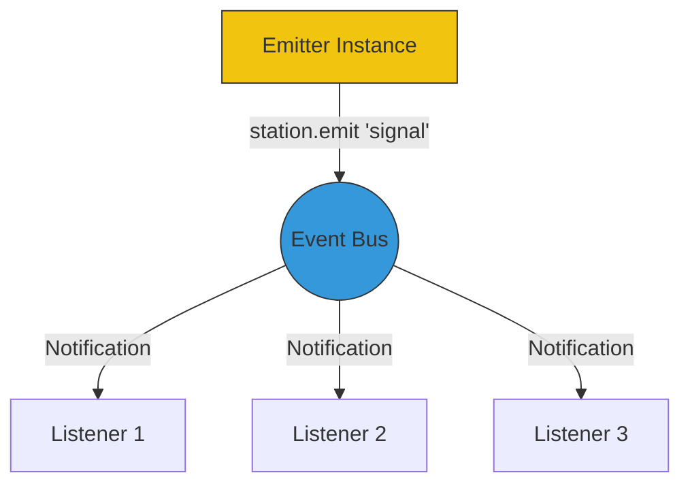

# CH-03: EventEmitter (Pub-Sub Architecture)

Banyak modul inti Node.js (seperti Streams dan HTTP) dibangun di atas kelas `EventEmitter`. Ini adalah implementasi dari pola desain **Observer**.

## 📡 The Broadcast Flow
Sebuah objek dapat memancarkan event bernama, dan fungsi apa pun ("listener") dapat berlangganan untuk bereaksi saat event tersebut terjadi.

## 🛠️ Metode Utama
- **.on(event, listener)**: Mendaftarkan fungsi untuk dijalankan setiap kali event terjadi.
- **.emit(event, ...args)**: Memicu event dan mengirimkan data ke para listener.
- **.once(event, listener)**: Mendaftarkan fungsi yang hanya akan dijalankan sekali, lalu dihapus.

> [!WARNING]
> **Memory Leaks**: Jika Anda menambahkan listener secara dinamis terus-menerus tanpa pernah menghapusnya (`.removeListener()`), Anda akan menyebabkan kebocoran memori. Node.js akan memberikan peringatan jika ada lebih dari 10 listener pada satu objek secara default.

---
*Lihat Lab: [Demo Custom Emitter](./examples/custom_emitter.js)*  
*Kembali ke [BK-03](../README.md)*
