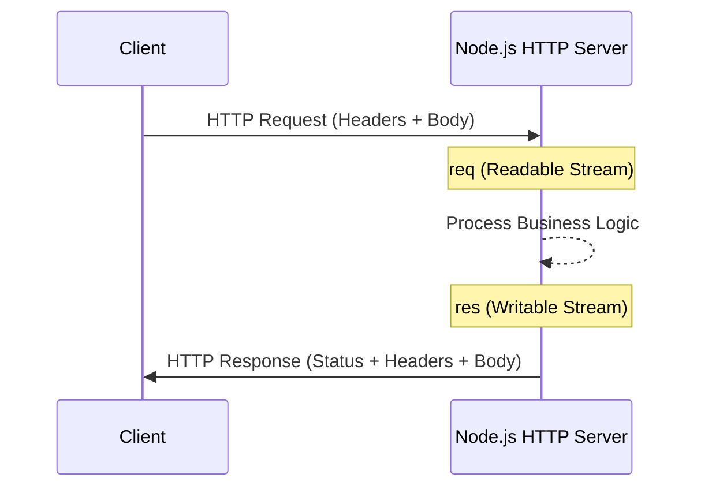

# CH-01: HTTP/HTTPS (Web Servers)

Node.js terkenal karena kemudahannya dalam membuat web server berperforma tinggi berkat modul bawaan `http` dan `https`.

## 🔄 Request-Response Lifecycle
Setiap koneksi HTTP di Node.js adalah event baru yang diproses oleh Event Loop.

## 🛠️ State of the Art: Beyond sync
Modul HTTP di Node.js bersifat **Streaming**. Artinya, Anda bisa mulai mengirimkan data ke klien bahkan sebelum file tersebut selesai dibaca sepenuhnya dari disk.

### Konsep Utama:
- **Keep-Alive**: Menjaga koneksi TCP tetap terbuka untuk beberapa request sekaligus.
- **TLS/SSL**: Modul `https` menggunakan modul `tls` di balik layar untuk enkripsi end-to-end.
- **Agents**: Digunakan untuk mengelola pool koneksi saat Node.js bertindak sebagai klien (misal: memanggil API eksternal).

> [!CAUTION]
> **Header Injection**: Selalu sanitasi data yang masuk ke header response untuk mencegah serangan keamanan (security vulnerabilities).

---
*Lihat Lab: [Demo HTTP Server](./examples/http_server.js)*  
*Kembali ke [BK-04](../README.md)*
