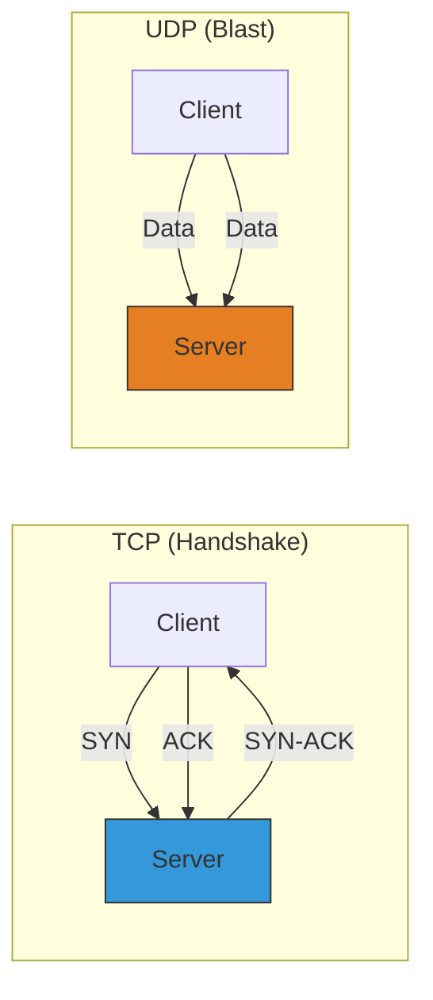

# CH-02: TCP/UDP (Lower Layer Networking)

Di bawah protokol HTTP, terdapat lapisan transport yang dikelola oleh modul `net` (untuk TCP) dan `dgram` (untuk UDP).

## 🚀 TCP vs 🕊️ UDP
- **TCP (Transmission Control Protocol)**: Berorientasi koneksi, menjamin data sampai dengan urutan yang benar (Reliable). Digunakan oleh HTTP, SSH, FTP.
- **UDP (User Datagram Protocol)**: Tanpa koneksi, lebih cepat tapi tidak menjamin data sampai (Fire and Forget). Digunakan oleh Video Streaming, Gaming, DNS.

## 🛠️ Use Cases di Node.js
1. **Custom Protocols**: Membuat database driver atau protokol komunikasi privat.
2. **Proxies**: Membangun Load Balancer tingkat rendah.
3. **IoT**: Berkomunikasi dengan perangkat keras yang hanya mendukung UDP sederhana.

> [!IMPORTANT]
> **Stream-based**: Node.js menangani socket TCP sebagai **Duplex Stream**. Anda bisa menggunakan `.pipe()` untuk menghubungkan socket langsung ke file atau socket lainnya.

---
*Lihat Lab: [TCP Echo Server](./examples/tcp_echo.js)*  
*Kembali ke [BK-04](../README.md)*
