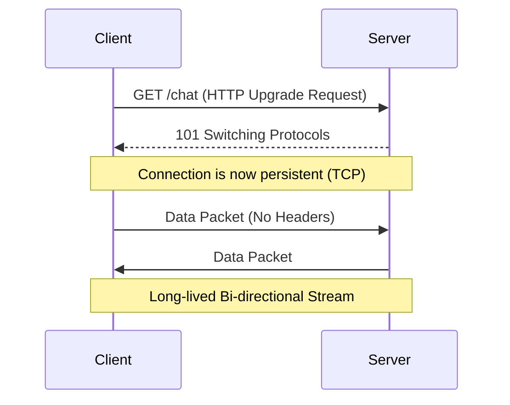

# CH-03: WebSockets (Real-time Full-Duplex)

WebSockets (WS) menyediakan saluran komunikasi dua arah yang persisten antara klien dan server melalui satu koneksi TCP.

## 🤝 The Upgrade Mechanism
WS tidak berjalan di jalur berbeda, melainkan menggunakan pintu HTTP untuk masuk, lalu mengubah status koneksi menjadi "Switching Protocols".

## 🌟 Karakteristik Utama
1. **Low Latency**: Tidak ada overhead header HTTP (seringkali >500 byte) untuk setiap pesan.
2. **Server Push**: Server dapat memberikan pembaruan data secara instan tanpa menunggu klien meminta.
3. **Stateful**: Koneksi tetap terbuka; server tahu persis siapa klien yang sedang terhubung.

## 🛠️ Node.js Ecosystem
Meskipun Node.js mendukung upgrade socket manual, industri biasanya menggunakan:
- **`ws` library**: Implementasi murni dan ringan.
- **`Socket.io`**: Menambah fitur seperti auto-reconnect, fallback (long polling), dan rooms.

---
*Lihat Lab: [Anatomi Handshake](./examples/ws_handshake.md)*  
*Kembali ke [BK-04](../README.md)*
