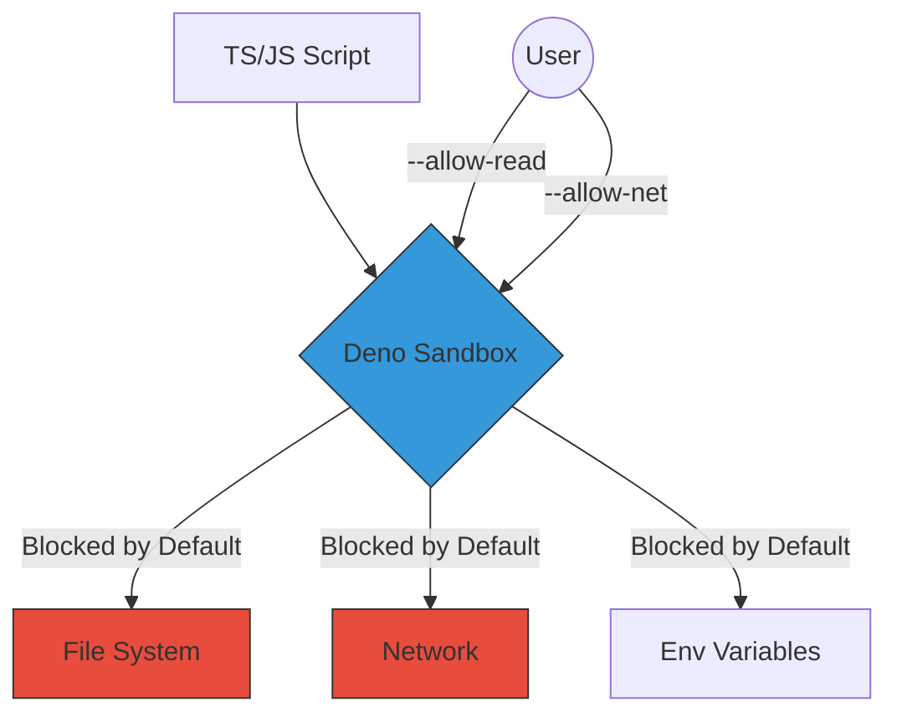

# CH-01: Security by Default (The Sandbox Model)

Filosofi utama Deno adalah keamanan. Tidak seperti Node.js yang memiliki akses bebas ke sistem Anda, Deno menjalankan kode di dalam **Sandbox** yang terisolasi.

## 🛡️ Permission System (Opt-in)
Secara default, naskah Deno tidak dapat menyentuh apa pun di luar memorinya sendiri.

## 🔐 Bendera Izin (Flags)
Beberapa flag yang paling sering digunakan:
- `--allow-read`: Membaca file.
- `--allow-write`: Menulis file.
- `--allow-net`: Akses internet/jaringan.
- `--allow-env`: Membaca environment variables.
- `--allow-run`: Menjalankan sub-proses.

> [!IMPORTANT]
> **Granular Control**: Anda dapat membatasi izin ke spesifik file atau domain, misalnya: `deno run --allow-read=/tmp --allow-net=google.com server.ts`. Ini jauh lebih aman daripada memberikan akses global.

---
*Lihat Lab: [Tes Sandbox](./examples/deno_secure.ts)*  
*Kembali ke [BK-01](../README.md)*
