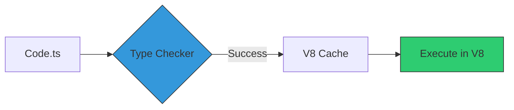

# CH-03: TypeScript Native (No-Config Execution)

Deno memposisikan dirinya sebagai runtime TypeScript tingkat pertama. Ia tidak memerlukan `tsc` atau *transpiler* eksternal untuk menjalankan kode `.ts`.

## 🛠️ Internal Compilation
Deno memiliki compiler TypeScript yang terintegrasi (berbasis Rust/V8) yang menangani pengecekan tipe dan konversi ke JS secara transparan.

## 🌟 Keuntungan Utama
1. **Zero Config**: Tidak perlu `tsconfig.json` untuk proyek sederhana.
2. **Speed**: Compiler ditulis dalam bahasa yang cepat (Rust), memberikan feedback instan.
3. **Consistency**: Versi TypeScript sudah terkunci di dalam versi Deno, sehingga tidak ada konflik versi antar anggota tim.

## 📦 Web Standard APIs
Deno menggunakan standard Web APIs (seperti `fetch`, `SubtleCrypto`, `Streams`) yang sudah terdefinisi tipe datanya secara global, membuat pengalaman coding TS terasa sangat "asli" (native).

> [!TIP]
> **Pro-Tip**: Anda tetap bisa menggunakan file `deno.json` jika memerlukan konfigurasi compiler yang sangat spesifik untuk proyek besar.

---
*Lihat Lab: [Eksekusi TS Native](./examples/deno_ts_native.ts)*  
*Kembali ke [BK-01](../README.md)*
