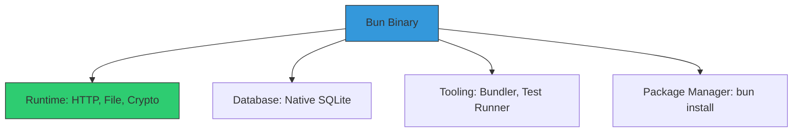

# CH-02: Built-in APIs (The Unified Toolset)

Bun bukan sekadar runtime; ia adalah penyaji "all-in-one" yang menyertakan banyak library yang biasanya harus Anda instal secara terpisah.

## 📦 Unified Architecture
Bun menggabungkan Runtime, Bundler, Transpiler, dan Test Runner dalam satu binary tunggal.

## 🌟 API Unggulan
- **`Bun.serve()`**: Web server tercepat di ekosistem JS.
- **`bun:sqlite`**: Driver database tercepat yang memanfaatkan kecepatan Zig.
- **`Bun.password`**: Enkripsi password (Bcrypt/Argon2) yang dioptimasi secara native.
- **`Bun.file()`**: Abstraksi file sistem yang lebih cepat dari modul `fs` Node.js.

> [!TIP]
> **Zero External Dependencies**: Dengan menggunakan API internal Bun, Anda mengurangi ukuran `node_modules` dan meminimalkan risiko keamanan dari supply chain attack.

---
*Lihat Lab: [Demo SQLite Native](./examples/bun_sqlite_demo.js)*  
*Kembali ke [BK-02](../README.md)*
