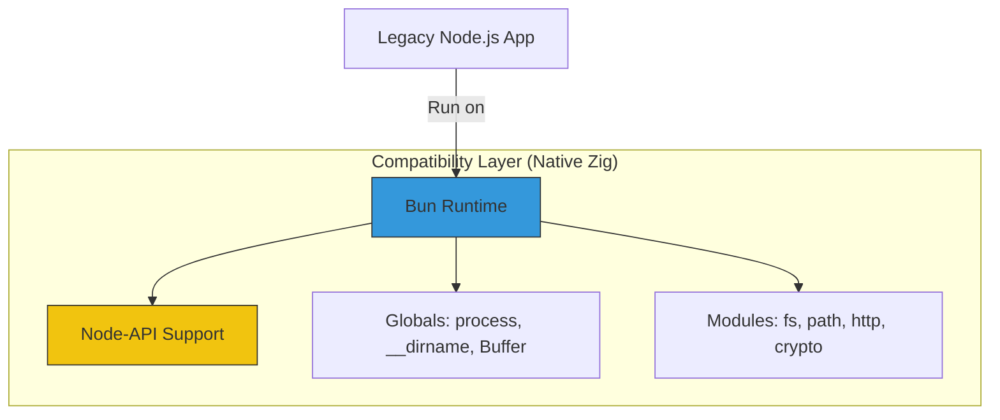

# CH-03: Drop-in Reliability (Node.js Compatibility)

Salah satu penghambat adopsi runtime baru adalah kompatibilitas dengan library yang sudah ada. Bun mengatasi hal ini dengan menjadi "Drop-in Replacement" untuk Node.js.

## 🌉 The Compatibility Layer
Bun tidak hanya menjalankan JavaScript, ia juga mengimplementasikan ribuan API internal Node.js secara native agar library dari NPM bisa berjalan tanpa modifikasi.

## 🌟 Fitur Kompatibilitas
1. **NPM Support**: `bun install` dapat membaca `package.json` dan menginstal dependensi dengan kecepatan yang jauh lebih tinggi.
2. **Node-API (N-API)**: Bun mendukung modul C++ yang dikompilasi untuk Node.js.
3. **Module Interop**: Bun secara otomatis menangani campuran CJS dan ESM dalam satu proyek tanpa pusing.

> [!IMPORTANT]
> **90% API Coverage**: Sebagian besar modul populer di NPM (seperti Express, Prisma, Lodash) berjalan dengan sempurna di Bun. Namun, selalu lakukan testing jika Anda menggunakan modul yang sangat bergantung pada perilaku internal C++ Node.js yang spesifik.

---
*Lihat Lab: [Tes Kompatibilitas Node](./examples/node_compat_check.js)*  
*Kembali ke [BK-02](../README.md)*
