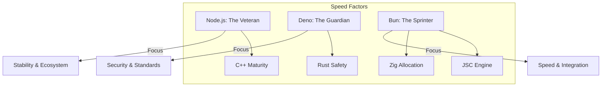

# CH-01: Performance Comparison (The Battle of Speed)

Membandingkan performa antar runtime bukan hanya soal "siapa yang lebih cepat", tapi bagaimana arsitektur mereka memengaruhi beban kerja yang berbeda.

## 📊 Performance Landscape

## ⚡ Faktor Penentu Kecepatan
1. **Startup Time**: Bun memimpin jauh karena penggunaan JavaScriptCore yang lebih ringan dibanding V8 saat inisialisasi.
2. **I/O Throughput**: Zig (Bun) dan Rust (Deno) cenderung lebih efisien dalam menangani jutaan request kecil dibanding C++ (Node.js) karena manajemen memori yang lebih modern.
3. **Execution**: Node.js seringkali unggul pada komputasi berat yang bersifat jangka panjang karena kematangan optimizer V8 (TurboFan).

> [!TIP]
> **Real-world bench**: Jangan hanya melihat grafik sintetik. Ujilah aplikasi Anda pada beban kerja nyata (database query, JSON parsing) untuk melihat runtime mana yang paling cocok bagi infrastruktur Anda.

---
*Lihat Lab: [Matriks Perbandingan](./examples/showdown_matrix.md)*  
*Kembali ke [BK-03](../README.md)*
