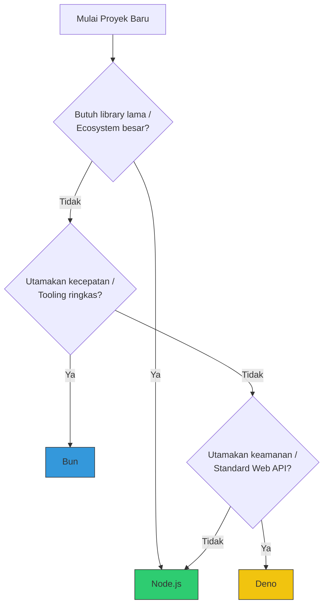

# Lab: Decision Guide (Which Runtime?)

Gunakan diagram ini untuk menentukan runtime mana yang paling cocok dengan kebutuhan spesifik Anda.

## 📋 Ringkasan Rekomendasi
- **Node.js**: Pilihan aman untuk enterprise, library stabil, dan tim besar.
- **Bun**: Pilihan tepat untuk startup, microservices, dan performa I/O ekstrim.
- **Deno**: Pilihan ideal untuk cloud functions, script mandiri, dan lingkungan yang mementingkan keamanan sandbox.
