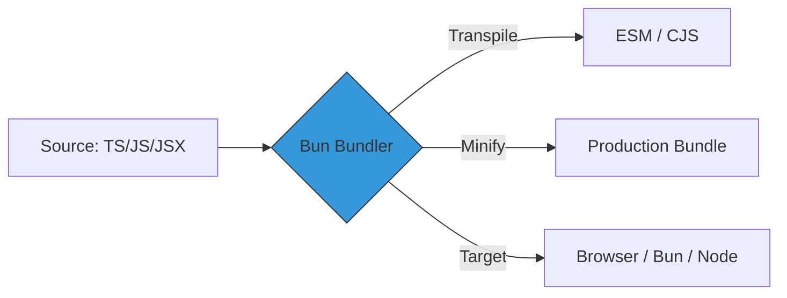

# CH-01: Bundlers (The Speed Runner)

Bun menyertakan bundler JavaScript dan TypeScript yang sangat cepat, menggantikan fungsi tool seperti Webpack, Rollup, atau esbuild.

## ⚡ Arsitektur Bun.build()
Ditulis dalam Zig, bundler Bun melakukan integrasi parsing, transpiling, dan minifying dalam satu fase tunggal.

## 🌟 Keunggulan Utama
1. **Performance**: Memproses jutaan baris kode dalam hitungan milidetik.
2. **Native TS/JSX**: Tidak perlu konfigurasi loader tambahan untuk TypeScript atau React (JSX).
3. **Internal Integration**: Karena menyatu dengan runtime, ia dapat melakukan optimasi khusus (seperti macro) yang tidak tersedia di bundler eksternal.

> [!IMPORTANT]
> **Minimalist Flow**: Anda bisa berhenti menggunakan rantai tool yang kompleks. Cukup satu file `build.js` atau satu command `bun build` untuk seluruh workflow frontend Anda.

---
*Lihat Lab: [Demo Bun Build](./examples/bun_build_demo.js)*  
*Kembali ke [BK-04](../README.md)*
