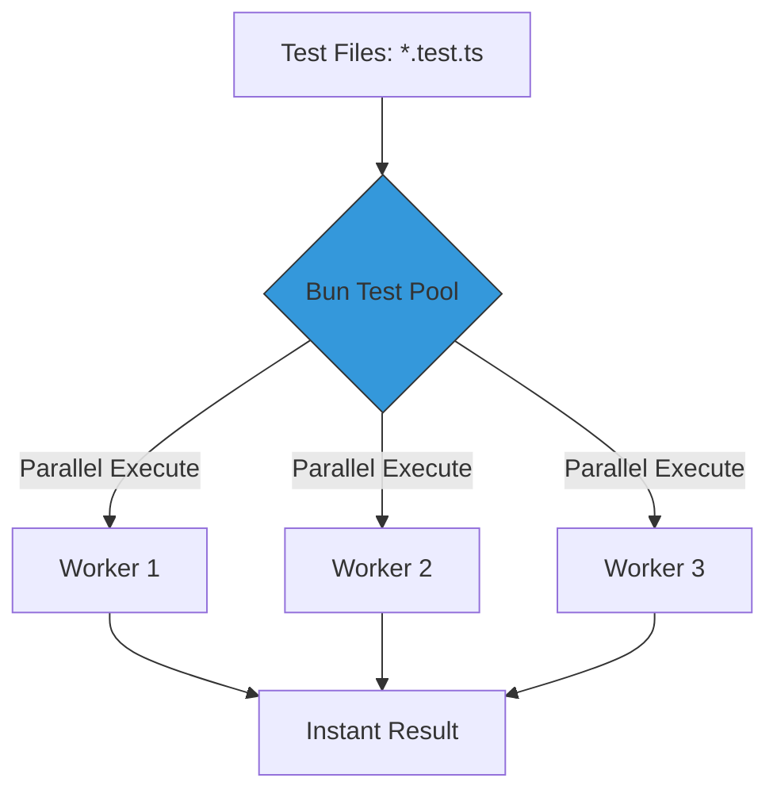

# CH-02: Test Runners (High-Speed Validation)

Pengecekan kode (testing) seringkali menjadi bagian paling lambat dalam workflow pengembangan. Bun menyertakan Test Runner yang kompatibel dengan standar industri namun dengan kecepatan startup nol.

## 🏎️ Bun Test Architecture
Alih-alih memuat framework berat, Bun menggunakan mesin internalnya untuk menjalankan pengujian secara paralel.

## 🌟 Fitur Utama
- **Jest Compatible**: Anda dapat menggunakan `expect`, `describe`, `test`, dan `beforeEach` persis seperti di Jest/Vitest.
- **Snapshot Testing**: Dukungan native untuk snapshot.
- **Auto-Reload (Watch Mode)**: Menjalankan ulang tes secara instan saat file berubah.
- **TypeScript Support**: Langsung menjalankan tes TS tanpa step kompilasi terpisah.

> [!TIP]
> **Performance Tip**: Jika suite pengujian Anda di Jest memakan waktu 10 detik, Bun Test seringkali dapat menyelesaikannya dalam kurang dari 1 detik.

---
*Lihat Lab: [Demo Bun Test](./examples/bun_test_demo.js)*  
*Kembali ke [BK-04](../README.md)*
