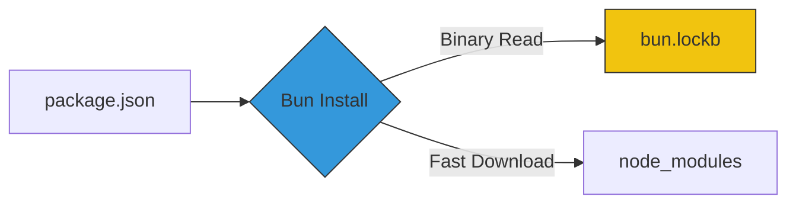

# CH-03: Dependency Management (The Package Engine)

Salah satu keluhan terbesar developer adalah lambatnya instalasi `node_modules`. Bun mendesain ulang proses ini dari nol menggunakan optimasi level sistem operasi.

## ⚡ Binary Lockfile & Speed
Bun menggunakan `bun.lockb`, sebuah format biner yang dioptimasi untuk kecepatan baca/tulis CPU, bukan untuk dibaca manusia.

## 🛠️ Strategi Utama
1. **Global Cache**: Bun menyimpan satu salinan setiap versi paket secara global, lalu membagikannya ke semua proyek menggunakan *hardlinks*.
2. **Optimized Network Stack**: Menggunakan implementasi HTTP kustom yang dirancang untuk mendownload ribuan paket kecil tipe NPM secara efisien.
3. **Workspaces Support**: Mendukung pengelolaan mono-repo dengan workspace yang kompleks secara native.

> [!TIP]
> **Migrasi**: Anda bisa mengkonversi lockfile NPM/Yarn ke format Bun secara otomatis saat pertama kali menjalankan `bun install`.

---
*Lihat Lab: [Analisa Performa Install](./examples/install_performance.md)*  
*Kembali ke [BK-04](../README.md)*
