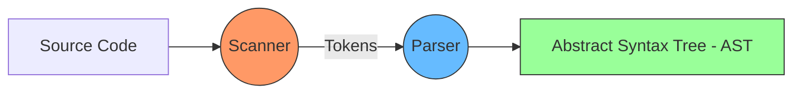

# CH-01: Scanner & Parser (From Source to AST)

Langkah pertama V8 dalam "Pipeline Eksekusi" adalah memahami struktur kode Anda secara sintaksis sebelum bisa dijalankannya.

## 🌀 Execution Flow
Berikut adalah gambaran bagaimana kode mentah Anda diubah menjadi struktur data logis:

## 🔍 The Scanner (Lexical Analysis)
Scanner memecah aliran karakter teks menjadi urutan **Tokens** (seperti `function`, `variable`, `(`, `{`). 
- **Tugas**: Menghapus whitespace dan komentar.
- **Analogi**: Scanner adalah "Penerjemah Morse" yang mengubah ketukan (karakter) menjadi kata-kata (token).

## 🌳 The Parser (Syntactic Analysis)
Parser mengambil token-token dari scanner dan membangun **Abstract Syntax Tree (AST)**. AST adalah representasi pohon dari struktur logis kode Anda.

V8 menggunakan dua strategi parsing untuk efisiensi:
1. **Full Parsing**: Digunakan untuk kode yang akan segera dieksekusi. Ini membangun AST lengkap dan menghasilkan informasi scope.
2. **Pre-parsing**: Digunakan untuk fungsi yang belum dipanggil. Ini hanya mengecek error sintaks dasar tanpa membangun AST lengkap, sehingga menghemat memori dan mempercepat startup time hingga 2x lipat.

> [!TIP]
> **Performance Hint**: Membungkus fungsi dalam tanda kurung `(function(){ ... })()` akan memaksa V8 melakukan *Full Parsing* segera, yang berguna jika Anda yakin fungsi tersebut akan langsung dipanggil.

---
*Kembali ke [BK-01](../README.md)*
