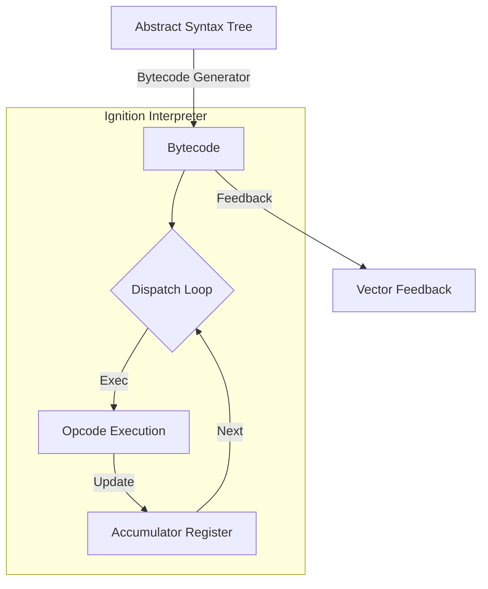

# CH-02: Ignition (The Bytecode Interpreter)

Setelah AST terbentuk, V8 tidak langsung mengubahnya menjadi Machine Code yang berat, melainkan ke arah **Bytecode** yang ringan melalui interpreter bernama **Ignition**.

## ⚙️ The Interpreter Architecture
Ignition menggunakan arsitektur berbasis register dengan register khusus yang disebut **Accumulator**.

## 🔥 Mengapa Ignition?
Sebelum era Ignition, V8 langsung melakukan kompilasi ke Machine Code (Full-codegen), yang memakan banyak memori (overhead sistem besar). Ignition diperkenalkan untuk:
1. **Memory Efficiency**: Bytecode berukuran jauh lebih kecil (up to 50-90%) dibanding Machine Code.
2. **Startup Speed**: Kompilasi ke Bytecode hampir seketika, memungkinkan script besar berjalan lebih cepat di awal.

## 📊 Profiling & Feedback Vector
Peran krusial Ignition bukan hanya menjalankan kode, tapi juga sebagai **Mata-mata (Profiler)**. 
- Sambil menjalankan bytecode, Ignition mencatat informasi tipe data (misal: "Apakah `x` selalu berupa Number?") ke dalam **Feedback Vector**.
- Informasi ini nantinya akan diserahkan ke **TurboFan** untuk optimasi tingkat tinggi.

> [!IMPORTANT]
> **Internalist Insight**: Setiap fungsi di V8 memiliki `FeedbackVector` sendiri. Jika data yang lewat berubah-ubah tipe (polymorphic), Ignition akan mencatatnya dan ini akan membatasi optimasi di tahap selanjutnya.

---
*Lihat Lab: [Bedah Bytecode](./examples/bytecode_anatomy.md)*  
*Kembali ke [BK-01](../README.md)*
